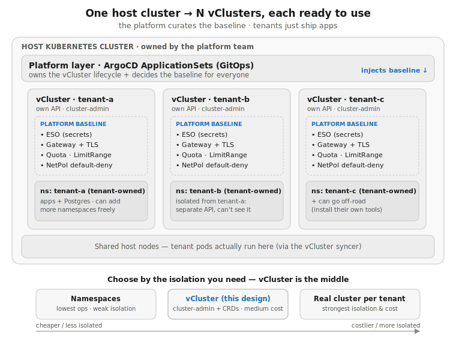
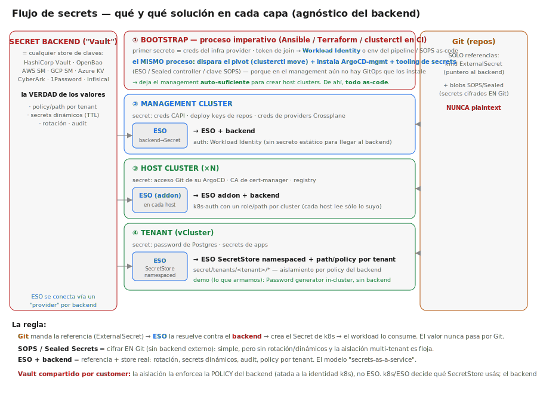

# vcluster-idp — a lightweight multi-tenant Internal Developer Platform

This repository implements a lightweight, declarative, and GitOps-driven **Internal Developer Platform (IDP)** designed to provision isolated development environments on-demand. 

Each tenant receives an isolated control plane (**vCluster**), a dedicated PostgreSQL database, two applications, auto-generated credentials, resource governance, network isolation, and external HTTPS access. The platform runs entirely through a GitOps facade (a CLI that commits to Git), allowing ArgoCD to reconcile and prune resources automatically.

> **In one sentence (end-to-end flow):** a developer commits one file (`platform <tenant> create` → Git) → **ArgoCD** reconciles it → **Crossplane + CAPI + KubeVirt** build the host clusters as VMs → **CAAPH + ClusterResourceSet** give each cluster its own ArgoCD → that ArgoCD uses **ApplicationSets + Helm + vCluster** to hand every tenant an isolated environment — all declarative, all GitOps, validated end-to-end down to a recursive *management-of-managements* (a management cluster that creates and fully serves its own child), torn down and rebuilt **clean-room from Git**.

---

## ── Repository Code Map ──

Use these links to navigate directly to the code implementing each component of the platform:

### 1. Tenant Workloads & Configurations
*   **GitOps Tenants Source of Truth**: [`tenants/dev/tenant-a.yaml`](./tenants/dev/tenant-a.yaml) (declares tenant specification, application versions, domain, and secret backend).
*   **Workload Helm Chart**: [`charts/tenant/`](./charts/tenant/) (the primary golden-path chart containing workloads and governance policies):
    *   [`customer-api.yaml`](./charts/tenant/templates/customer-api.yaml) / [`customer-web.yaml`](./charts/tenant/templates/customer-web.yaml) — deploy `customer-api` (`go-httpbin`) and `customer-web` (`nginx`).
    *   [`postgres.yaml`](./charts/tenant/templates/postgres.yaml) — deploys the dedicated PostgreSQL StatefulSet and Service.
    *   [`secret.yaml`](./charts/tenant/templates/secret.yaml) — holds the auto-generated database credentials (Helm `lookup` or External Secrets templates).
    *   [`namespace.yaml`](./charts/tenant/templates/namespace.yaml) · [`resourcequota.yaml`](./charts/tenant/templates/resourcequota.yaml) · [`limitrange.yaml`](./charts/tenant/templates/limitrange.yaml) — the tenant namespace plus its resource governance (quota + default container requests/limits).
    *   [`networkpolicy.yaml`](./charts/tenant/templates/networkpolicy.yaml) — enforces tenant network isolation using `CiliumNetworkPolicy`.
*   **Route Helm Chart**: [`charts/tenant-route/`](./charts/tenant-route/) (north-south access deployed on the host: [`gateway.yaml`](./charts/tenant-route/templates/gateway.yaml) + [`httproutes.yaml`](./charts/tenant-route/templates/httproutes.yaml) + TLS).

### 2. GitOps & Platform Generators
*   **ApplicationSets (ArgoCD)**: [`applicationsets/`](./applicationsets/) (controllers generating resources based on git configurations):
    *   [`hosts-appset.yaml`](./applicationsets/hosts-appset.yaml) — provisions the virtual cluster control plane on the host.
    *   [`tenants-appset.yaml`](./applicationsets/tenants-appset.yaml) — deploys the workload chart *inside* the virtual cluster.
    *   [`routes-appset.yaml`](./applicationsets/routes-appset.yaml) — provisions external routing (Gateway API) on the host.
    *   [`eso-appset.yaml`](./applicationsets/eso-appset.yaml) — optional controller to install External Secrets Operator per-tenant.
*   **ArgoCD App-of-Apps**: [`platform/root-app.yaml`](./platform/root-app.yaml) (bootstraps the platform add-ons on the host cluster).

### 3. CLI Automation & Scripts
*   **Platform Lifecycle Facade**: [`cli/platform`](./cli/platform) (implements `platform <tenant> <create|delete|status>`).
*   **ArgoCD vCluster Auto-Join**: [`platform/vcluster-register`](./platform/vcluster-register/vcluster-register.yaml) — a declarative CronJob (on Root and every regional host) that auto-registers each tenant vCluster as an ArgoCD target so workloads deploy inside it with **no manual step**; [`cli/register-vcluster`](./cli/register-vcluster) is the manual-override equivalent.
*   **E2E Validation Catalog**: [`cli/validate`](./cli/validate) (automates the 27 functional checks verifying every platform requirement).
*   **Multicluster Query Tool**: [`cli/fleet-test`](./cli/fleet-test) (routes kubectl queries to nested VM host clusters).
*   **Platform Showcase** (read-only): [`cli/showcase-platform`](./cli/showcase-platform) (narrated tour of the whole architecture — KubeVirt, Crossplane, CAPI, ArgoCD, vCluster isolation, Gateway/TLS).
*   **Topology Showcase** (read-only): [`cli/showcase-topology`](./cli/showcase-topology) (demonstrates the cluster-topology & vCluster placement models, including the recursion).
*   **Fleet Showcase** (read-only): [`cli/showcase-fleet`](./cli/showcase-fleet) (walkthrough of inspecting the created host clusters via `cli/fleet-test`).

### 4. Advanced Fleet & Infrastructure Definitions
*   **Cluster API (CAPI) VM Host Clusters**: [`clusters/homelab/`](./clusters/homelab/) — the CAPK/KubeVirt VM host clusters ([`host-euw1.yaml`](./clusters/homelab/host-euw1.yaml) regional, [`host-mgmt.yaml`](./clusters/homelab/host-mgmt.yaml) management) plus [`machinehealthchecks.yaml`](./clusters/homelab/machinehealthchecks.yaml) (worker auto-remediation).
*   **Crossplane v2 Composition & XRD**: [`fleet/config/`](./fleet/config/) — the infrastructure composition layer:
    *   [`crossplane-xrd.yaml`](./fleet/config/crossplane-xrd.yaml) — the custom `HostCluster` resource API.
    *   [`crossplane-composition.yaml`](./fleet/config/crossplane-composition.yaml) — the pipeline that composes a `HostCluster` into the CAPI/CAPK object tree.
    *   [`capi-providers.yaml`](./fleet/config/capi-providers.yaml) · [`storageclass-vm.yaml`](./fleet/config/storageclass-vm.yaml) — the CAPI providers and the Longhorn StorageClass backing VM disks.
*   **Virtualization & HCI storage**: [`fleet/kubevirt/`](./fleet/kubevirt/) (KubeVirt VM controller) and [`fleet/cdi/`](./fleet/cdi/) (CDI — imports the cloud image into a replicated Longhorn PVC per VM disk).
*   **Platform bootstrap (app-of-apps)**: [`platform/root-app.yaml`](./platform/root-app.yaml) + [`platform/addons/`](./platform/addons/) — each cluster's ArgoCD self-installs the platform services from here (CAPI operator, Crossplane, KubeVirt/CDI, provider-kubernetes, the `fleet-*` ApplicationSets, the tenant ApplicationSets, and `vcluster-register`).
*   **CNI bootstrap (egg-and-chicken)**: [`clusters/cni/`](./clusters/cni/) — a `ClusterResourceSet` per CNI variant seeds the CNI into each freshly-created cluster (matched by the cluster's `cni` label) ([`calico-vxlan.yaml`](./clusters/cni/calico-vxlan.yaml), [`calico.yaml`](./clusters/cni/calico.yaml), [`cilium.yaml`](./clusters/cni/cilium.yaml)).
*   **Recursion (management-of-managements)**: [`clusters/management/`](./clusters/management/) — a `management` cluster receives ArgoCD + a region-root via CAAPH/CRS (`helmchartproxy-*.yaml`, `region-root-*.yaml`) and itself CREATES a child workload cluster (`mgmt-child-*.yaml`) on the Root's KubeVirt.
*   **Regional GitOps Base**: [`clusters/regions/`](./clusters/regions/) — parameterized regional root + tenants for multi-region; the shared body lives in [`_base/`](./clusters/regions/_base/) (token `REGION`), instantiated per region like `eu-west1`.
*   **vCluster isolation models**: [`vcluster/`](./vcluster/) — the per-tenant control-plane definitions ([`shared-nodes.yaml`](./vcluster/shared-nodes.yaml) default, [`private-nodes.yaml`](./vcluster/private-nodes.yaml)) — the isolation spectrum: shared-nodes (default) -> dedicated/private nodes -> separate clusters.
*   **Production reference (paper)**: [`clusters/prod/eu-west-host.yaml`](./clusters/prod/eu-west-host.yaml) — how a host would be defined in production (RKE2 + CIS hardening); a reference, not running in the homelab.

---

## 1.5 Platform Components — what each piece is and how I apply it

The platform is built from well-known CNCF building blocks. This table is the at-a-glance map: **what
each component is, the exact role it plays here, where it lives in the repo, and which requirement /
Design Question (Q) it answers.** Read top-to-bottom it is the full request flow: a CLI commit → ArgoCD
reconciles → Crossplane/CAPI build the host cluster → ArgoCD inside it builds the tenant.

| Component | What it is | How I apply it in this platform | Where in the repo | Answers |
|---|---|---|---|---|
| **`platform` CLI** | Tenant lifecycle facade | `platform <tenant> create\|delete\|status` does **not** deploy imperatively — it writes & commits `tenants/<env>/<tenant>.yaml` (the source of truth) and lets GitOps reconcile. Idempotent, drift-aware "for free". | [`cli/platform`](./cli/platform) | Req 2, 9, 10, 11; Q7 |
| **ArgoCD** | GitOps engine | **Central** ArgoCD runs an app-of-apps (`platform-root`) + 4 ApplicationSets; **each regional cluster runs its OWN ArgoCD** (decentralized → no control-plane SPOF). | [`platform/`](./platform/) | Q1, Q3; Req 9–11 |
| **ApplicationSet** | Templated app generator | Git generators read each tenant file and materialize **one vCluster + one workload (+route +ESO) per tenant** automatically. | [`applicationsets/`](./applicationsets/) | Q2, Q3 |
| **Helm charts** | Packaging / golden path | `charts/tenant` = the whole tenant unit (namespace, ResourceQuota, LimitRange, CiliumNetworkPolicy, Secret, PostgreSQL, api, web). `charts/tenant-route` = Gateway + HTTPRoute + TLS. Onboarding an app = values, not platform changes. | [`charts/`](./charts/) | Req 3, 4, 5, 6; Infra-def |
| **vCluster** | Per-tenant control plane | Each tenant gets an isolated virtual API server + etcd (shared-nodes by default) → no CRD/RBAC collisions; the isolation knob (spectrum from shared → dedicated → separate clusters). | [`vcluster/`](./vcluster/) | Req 1, 3; Q6 |
| **Crossplane v2** | Infra composition | A custom **`HostCluster` XR** (our own platform API) is composed into the CAPI object tree (each wrapped in a provider-kubernetes `Object` to hand ownership to CAPI). | [`fleet/config/`](./fleet/config/) | Q1 |
| **Cluster API + CAPK** | Cluster lifecycle | Turn a one-file `HostCluster` request into a **real Kubernetes cluster whose nodes are KubeVirt VMs**; declarative create/upgrade/delete of the fleet. | [`clusters/homelab/`](./clusters/homelab/), [`fleet/`](./fleet/) | Q1 |
| **KubeVirt + CDI** | Virtualization / storage | Runs guest-cluster nodes as VMs on the bare-metal node; CDI DataVolumes back the VM disks on Longhorn (HCI). | [`fleet/kubevirt/`](./fleet/kubevirt/) | Q1 |
| **ClusterResourceSet** | Bootstrap injector | Seeds the **CNI** and the **`region-root`** app into each freshly-created cluster (egg-and-chicken bootstrap). | [`clusters/cni/`](./clusters/cni/), [`clusters/management/`](./clusters/management/) | Q1, Q3 |
| **CAAPH (HelmChartProxy)** | Addon delivery | Installs ArgoCD **into** every `role=management` cluster (too big for a CRS ConfigMap). | [`clusters/management/`](./clusters/management/) | Q1, Q3 |
| **Cilium** | CNI + Gateway + policy | Host dataplane, `GatewayClass` for north-south access, and **default-deny `CiliumNetworkPolicy`** for cross-tenant isolation. | [`charts/tenant/templates/networkpolicy.yaml`](./charts/tenant/templates/networkpolicy.yaml) | Req 7, 12; Q5, Q6 |
| **cert-manager** | TLS automation | Issues the Gateway TLS certificates (gateway-shim). | [`applicationsets/routes-appset.yaml`](./applicationsets/routes-appset.yaml) | Req 12; Q5 |
| **External Secrets (ESO)** | Secrets (opt-in) | Per-tenant in-cluster secret generation without storing material in Git (default is Helm-generated). | [`applicationsets/eso-appset.yaml`](./applicationsets/eso-appset.yaml) | Req 8; Q6 |
| **MachineHealthCheck** | Resilience | CAPI auto-remediates unhealthy worker Machines (declarative alternative to manual recovery). | [`clusters/homelab/machinehealthchecks.yaml`](./clusters/homelab/machinehealthchecks.yaml) | Q1 (resilience) |

> **One sentence:** the **CLI** commits intent to Git; **ArgoCD** reconciles it; **Crossplane + CAPI +
> KubeVirt** build the host clusters; **CAAPH + ClusterResourceSet** give each cluster its own ArgoCD;
> that ArgoCD uses **ApplicationSets + Helm charts + vCluster** to give every tenant an isolated
> environment — all declarative, all GitOps. §3.1 shows the topology variants; §3.2 the failure modes.

---

## 2. Quick Start: How to Run & Verify

The supported flow is declarative GitOps: the CLI commits the tenant to Git and ArgoCD reconciles everything (the vCluster, the auto-registration, and the workload inside it). It runs on any cluster with ArgoCD installed.

1.  **Bootstrap the Platform Add-ons**:
    ```bash
    make bootstrap-existing
    # (or run 'make bootstrap' to spin up a fresh Kind cluster and install ArgoCD)
    ```
2.  **Create a Tenant**:
    Runs the CLI to write and commit `tenants/dev/tenant-a.yaml` into Git.
    ```bash
    ./cli/platform tenant-a create --api-version 2.23.1 --web-version 1.27-alpine
    ```
3.  **Verify the Tenant Status**:
    The workload runs *inside* the tenant's vCluster, so ArgoCD must have that vCluster registered as a target.
    This is **automatic**: the `vcluster-register` CronJob (on Root and on every regional host) registers each new
    vCluster and ArgoCD then deploys the workload into it — no manual step. A tenant is just a Git commit.
    *(First run: allow a couple of minutes for the vCluster to come up and auto-register. `cli/register-vcluster`
    remains available as a manual override / one-off bootstrap, but is not required.)*
    ```bash
    ./cli/platform tenant-a status
    ```
4.  **Run the Validation Tests**:
    ```bash
    ./cli/validate tenant-a dev
    ```
5.  **Delete the Tenant**:
    ```bash
    ./cli/platform tenant-a delete
    ```

---

## 2.3. Interactive Demo Recordings & Platform Showcase
Real, live terminal recordings (asciinema) — click to play:

<table align="center">
  <tr>
    <td align="center" width="25%">
      <b>1. Add a Tenant</b><br/>
      <a href="https://asciinema.org/a/deIAZiSuxuB8RAo6" target="_blank">
        
      </a>
    </td>
    <td align="center" width="25%">
      <b>2. Delete a Tenant</b><br/>
      <a href="https://asciinema.org/a/Wd5gdGCF5PMgcXVA" target="_blank">
        
      </a>
    </td>
    <td align="center" width="25%">
      <b>3. Tenant Validation</b><br/>
      <a href="https://asciinema.org/a/OPuNETxXnTwzKVhT" target="_blank">
        
      </a>
    </td>
    <td align="center" width="25%">
      <b>4. Full Platform Showcase</b><br/>
      <a href="https://asciinema.org/a/lr5tg4GWV8KK5tF6" target="_blank">
        
      </a>
    </td>
  </tr>
  <tr>
    <td align="center" width="25%">
      <b>5. Topology &amp; Hierarchy</b><br/>
      <a href="https://asciinema.org/a/w2oxEgyacAJSRDQI" target="_blank">
        
      </a>
    </td>
    <td align="center" width="25%">
      <b>6. Fleet Inspection (fleet-test)</b><br/>
      <a href="https://asciinema.org/a/LRxKPe9RE8adnPwV" target="_blank">
        
      </a>
    </td>
    <td align="center" width="25%">
      <b>7. vClusters Detail (vc-info)</b><br/>
      <a href="https://asciinema.org/a/Q6oTIeH31tHCaIXv" target="_blank">
        
      </a>
    </td>
    <td align="center" width="25%">
      <b>8. Bonus: Multi-tenant GPU (HAMi)</b><br/>
      <a href="https://asciinema.org/a/n2EoxXTNhSslSXsg" target="_blank">
        
      </a>
    </td>
  </tr>
</table>

What each recording shows (one line each):
1. **Add a Tenant** — `cli/platform create` commits the tenant to Git; ArgoCD provisions the vCluster, the `vcluster-register` CronJob auto-registers it, and the workload converges — fully hands-off.
2. **Delete a Tenant** — `cli/platform delete` removes the Git source; ArgoCD prunes the Apps and the register CronJob's GC reconciles the teardown (namespace, PVC and registration gone, no leftovers).
3. **Tenant Validation** — `cli/validate` runs the functional checks against a live tenant.
4. **Full Platform Showcase** — `cli/showcase-platform`: read-only tour (KubeVirt, Crossplane, CAPI, ArgoCD, vCluster isolation, Gateway/TLS).
5. **Topology & Hierarchy** — `cli/showcase-topology`: the topology models live, including the recursion (`host-mgmt -> mgmt-child`).
6. **Fleet Inspection** — `cli/showcase-fleet`: reaching the created host clusters via jump pods (VM->node placement, per-layer health, each cluster's ArgoCD + vClusters).
7. **vClusters Detail** — `cli/fleet-test vc-info`: a rich card per vCluster across the fleet — Git source + domain, its ArgoCD apps, what runs in it, what it exposes (HTTPRoute), and how to operate it (kubeconfig).
8. **Bonus: Multi-tenant GPU (HAMi)** — bare-metal GPUs sliced with hard VRAM/compute caps: per-tenant GPU budget + live metrics, a tenant's capped slice inside its vCluster, an over-budget request kept **Pending** (guardrail), one pod spanning **both** cards, and a live Ollama LLM. Not an IDP requirement — see [`bonus/`](./bonus/).

### 📄 Full Read-Only Validation Output (Text Version)
If the terminal recording scrolls too quickly, you can expand these sections to read the exact text output:

<details>
<summary><b>Click to expand the full text output of the <code>Add a Tenant</code> recording (<code>cli/platform create</code>)</b></summary>

```text
━━ Add a tenant — one command, then GitOps does the rest (hands-off) ━━
A developer asks for a tenant: no kubectl, no helm — just the CLI facade.
━━ 1/6  Declare intent (the CLI writes the source of truth to Git) ━━
▶ Tenant 'tenant-d' (env=dev) → writing source of truth
✔ tenants/dev/tenant-d.yaml written
✔ GitOps commit created — ArgoCD will reconcile the ApplicationSets
▶ forcing ApplicationSets refresh…
▶ verify with: platform tenant-d status
━━ 2/6  What it wrote, and the commit it made ━━
tenant:
  name: tenant-d
  environment: dev
  domain: example.local
  secretBackend: generated   # generated | eso
applications:
  api:
    version: "2.23.1"
  web:
    version: "1.27-alpine"
e755489 (HEAD -> main) feat(tenant): provision tenant-d in dev
━━ 3/6  Publish -> ArgoCD reconciles from Git (no imperative apply) ━━
To https://github.com/villadalmine/vcluster-idp.git
   e98dbf1..e755489  main -> main
━━ 4/6  ArgoCD materializes the tenant Apps (vcluster, route, eso, workload) ━━
NAME                           SYNC STATUS   HEALTH STATUS
route-tenant-d-dev             OutOfSync     Progressing
vcluster-tenant-d-dev          OutOfSync     Missing
━━ 5/6  The vCluster spins up, then AUTO-REGISTERS in ArgoCD (no manual step) ━━
Waiting for the vCluster pod to be Running...
vcluster-tenant-d-dev-0   Running
Waiting for the vcluster-register CronJob to register it (runs every 5 min — fully hands-off)...
Auto-registered by the vcluster-register CronJob:
vcluster-tenant-d-dev   vcluster-register
━━ 6/6  The workload converges INSIDE the vCluster (PostgreSQL + API + Web) ━━
Waiting for all components to become Ready...
Tenant: tenant-d
Namespace: Ready
vCluster: Ready
PostgreSQL: Ready
API Application: Ready
Web Application: Ready
Age: 4m
━━ Done — a tenant is just a Git commit. ArgoCD + the register CronJob did the rest. ━━
```

</details>

<details>
<summary><b>Click to expand the full text output of the <code>Delete a Tenant</code> recording (<code>cli/platform delete</code>)</b></summary>

```text
━━ Delete a tenant — same facade in reverse (GitOps prune + GC reconcile) ━━
Starting state: tenant-d is up, registered, and serving.
NAME                           SYNC STATUS   HEALTH STATUS
eso-tenant-d-dev               Synced        Healthy
route-tenant-d-dev             Synced        Healthy
vcluster-tenant-d-dev          Synced        Healthy
wl-tenant-d-dev                Synced        Healthy
━━ 1/4  Remove the source of truth from Git ━━
▶ Tenant 'tenant-d' (env=dev) → deleting
✔ tenants/dev/tenant-d.yaml removed
✔ delete commit — Argo will prune the Applications (vcluster + workload)
namespace "vcluster-tenant-d-dev" deleted
secret "vcluster-tenant-d-dev" deleted from argocd namespace
━━ 2/4  Publish -> ArgoCD prunes the tenant Apps ━━
To https://github.com/villadalmine/vcluster-idp.git
   e8df84a..5c29730  main -> main
vcluster/route Apps delete cleanly (host destination). The in-vCluster Apps (eso/workload)
would otherwise hang on their ArgoCD finalizer against the now-deleted vCluster...
━━ 3/4  ...so the vcluster-register CronJob's GC reconciles the teardown ━━
It runs every 5 min; triggering it now instead of waiting for the schedule:
  reconciling... Apps left: 4   namespace: 1     reconciling... Apps left: 1   namespace: 0     reconciling... Apps left: 0   namespace: 1     reconciling... Apps left: 0   namespace: 0
━━ 4/4  Clean — no leftover Apps, namespace + registration gone ━━
  ✔ no tenant-d Apps
  ✔ vCluster namespace gone (PVC cascaded)
  ✔ registered clusters back to 7
━━ Delete is GitOps too: drop the commit, ArgoCD prunes, the GC reconciles the rest. ━━
```

</details>


<details>
<summary><b>Click to expand the full text output of <code>./cli/showcase-platform</code></b></summary>

```text
Starting Platform Showcase & Validation (Full Read Test)
Running passive and read-only checks...

═══════════════════════════════════════════════════════════════════════════
 1. Node Virtualization & Compute (KubeVirt)
═══════════════════════════════════════════════════════════════════════════
 ℹ️ What this demonstrates: Hypervisor-level compute isolation. Host cluster nodes run as KubeVirt Virtual Machines (VMs) on the physical host node srv-t7910.

  • Checking KubeVirt control plane (namespace: kubevirt)...
  ✔ KubeVirt control plane active: 6/6 pods in Running state.
  • Checking active Virtual Machines (VMs) backing the fleet (namespace: fleet)...
  ✔ Found 4 KubeVirt VMs (4 in Running state) in the 'fleet' namespace.
      host-euw1-control-plane-gw2k6   Running   true
      host-euw1-md-0-lvzrh-8twht      Running   true
      host-mgmt-control-plane-6g64b   Running   true
      host-mgmt-md-0-8x9kw-cm7fx      Running   true
  • Checking physical x86 compute node (srv-t7910)...
  ✔ Physical node srv-t7910 is READY (Hypervisor compute active).

═══════════════════════════════════════════════════════════════════════════
 2. GPU Governance & Slicing (HAMi vGPU)
═══════════════════════════════════════════════════════════════════════════
 ℹ️ What this demonstrates: Shared GPU usage (Tesla P4 & Quadro M4000) with hard VRAM (in MiB) and cores (%) isolation per tenant, without requiring MIG hardware.

  • Checking HAMi mutating admission webhook...
  ✔ MutatingWebhook 'hami-webhook' registered and active.
  • Checking HAMi controllers (namespace: kube-system)...
  ✔ HAMi controllers active (Device Plugin: 1 pods, Scheduler: 1 pods).
  • Checking advertised vGPU resources on node srv-t7910...
  ✔ Node srv-t7910 advertises vGPU capacity: 20 virtual cores/slices available.
  • Physical GPU configuration detected by HAMi:
      • NVIDIA-Tesla P4: 7680 MiB VRAM total, 10 slices vGPU, modo hami-core
      • NVIDIA-Quadro M4000: 8192 MiB VRAM total, 10 slices vGPU, modo hami-core

═══════════════════════════════════════════════════════════════════════════
 3. Declarative Infrastructure Composition (Crossplane v2)
═══════════════════════════════════════════════════════════════════════════
 ℹ️ What this demonstrates: Crossplane abstraction of underlying infrastructure. Defines a custom 'HostCluster' resource type that Crossplane automatically composes into CAPI and KubeVirt resources.

  • Checking Crossplane operator (namespace: crossplane-system)...
  ✔ Crossplane operator running successfully (4 pods).
  • Checking HostCluster Composite Resource Definition (XRD) and Composition...
  ✔ XRD 'hostclusters.fleet.homelab.io' established successfully.
  ✔ Composition 'hostcluster-kubevirt' configured.
  • Checking active HostCluster instances (XR resources)...
  ✔ Found 2 HostClusters declared via Crossplane:
      host-euw1   True   True   <none>
      host-mgmt   True   True   <none>

═══════════════════════════════════════════════════════════════════════════
 4. Multicluster Provisioning with CAPI & CAPK
═══════════════════════════════════════════════════════════════════════════
 ℹ️ What this demonstrates: Automated and declarative cluster creation, upgrades, and deletion. CAPI (Cluster API) and CAPK (Provider KubeVirt) orchestrate the k8s lifecycle of the host clusters.

  • Checking Cluster API (CAPI) controllers and KubeVirt provider (CAPK)...
      • caaph-system/caaph-controller-manager (1 ready)
      • capi-kubeadm-bootstrap-system/capi-kubeadm-bootstrap-controller-manager (1 ready)
      • capi-kubeadm-control-plane-system/capi-kubeadm-control-plane-controller-manager (1 ready)
      • capi-operator-system/cluster-api-operator (1 ready)
      • capi-system/capi-controller-manager (1 ready)
      • capk-system/capk-controller-manager (1 ready)
  • Checking CAPI Clusters status in 'fleet' namespace...
  ✔ CAPI is managing 2 Kubernetes clusters:
      host-euw1   Provisioned   true   true
      host-mgmt   Provisioned   true   true
  • Checking CAPI Machine ↔ KubeVirt VM mapping...
      host-euw1-control-plane-gw2k6   host-euw1   Running   host-euw1-control-plane-gw2k6
      host-euw1-md-0-lvzrh-8twht      host-euw1   Running   host-euw1-md-0-lvzrh-8twht
      host-mgmt-control-plane-6g64b   host-mgmt   Running   host-mgmt-control-plane-6g64b
      host-mgmt-md-0-8x9kw-cm7fx      host-mgmt   Running   host-mgmt-md-0-8x9kw-cm7fx

═══════════════════════════════════════════════════════════════════════════
 5. Decentralized GitOps (ArgoCD & ClusterResourceSets)
═══════════════════════════════════════════════════════════════════════════
 ℹ️ What this demonstrates: Git desired state synchronization without a central SPOF. Each regional host cluster runs its own ArgoCD seeded by CAPI via ClusterResourceSets.

  • Checking central ArgoCD (namespace: argocd)...
  ✔ Central ArgoCD active, root application 'platform-root' is HEALTHY.
  • Detected GitOps ApplicationSets:
      • tenant-eso
      • tenant-routes
      • tenant-vclusters
      • tenant-workloads
  • Checking ClusterResourceSets (CRS) for network/GitOps bootstrapping...
  ✔ Found 6 ClusterResourceSets in 'fleet' namespace (injecting CNI and regional config):
      • calico-cni
      • calico-vxlan-cni
      • cilium-cni
      • mgmt-child
      • mgmt-child-addons
      • region-root-eu-west1

═══════════════════════════════════════════════════════════════════════════
 6. Connectivity & Health Check of Regional host-euw1
═══════════════════════════════════════════════════════════════════════════
 ℹ️ What this demonstrates: Real connectivity validation via jump pod inside the management pod network. Verifies that the remote cluster is running, nodes are ready, CNI is healthy, and its local ArgoCD is active.

  • Interacting with host-euw1 (jump pod)...

    ══ CLUSTER host-euw1 ══
      ✔ CAPI: phase=Provisioned controlPlaneReady=true
      ✔ nodes Ready: 2
          - host-euw1-control-plane-gw2k6  Ready  (control-plane)  → VM on hypervisor node: srv-t7910
          - host-euw1-md-0-lvzrh-8twht  Ready  (<none>)  → VM on hypervisor node: srv-t7910
      ✔ CNI pods Running: 3
          - calico-kube-controllers-5d7d9cdfd8-sft8p  (Running)
          - calico-node-6s5cl  (Running)
          - calico-node-c2mnh  (Running)
      ✔ cross-node DNS (MTU): OK
      ✔ StorageClasses: 1
          - local-path
      ✔ ArgoCD apps: 3
          - region-root  Synced/Healthy
          - vcluster-tenant-a-dev  Synced/Healthy
          - wl-tenant-a-dev  Synced/Healthy
      ✔ vClusters: 1
          - vcluster-register-29701455-dlhqc  (Completed)
          - coredns-df8c87f55-2p65n-x-kube-system-x-vcluster-tenant-a-dev  (Running)
          - tenant-a-customer-api-897db9d68-hhht5-x-tenant-a-x-v-c0cc5d9b3f  (Running)
          - tenant-a-customer-web-5fcdf6ccb5-9dqnz-x-tenant-a-x--90200e5fc1  (Running)
          - tenant-a-postgres-0-x-tenant-a-x-vcluster-tenant-a-dev  (Running)
          - vcluster-tenant-a-dev-0  (Running)

═══════════════════════════════════════════════════════════════════════════
 7. Tenant Virtual Control Plane & Network Isolation (vCluster + CNP)
═══════════════════════════════════════════════════════════════════════════
 ℹ️ What this demonstrates: Virtual API server and etcd per tenant via vCluster, avoiding CRD conflicts. Physical network is isolated with host-side CiliumNetworkPolicies, blocking cross-tenant traffic.

  • Listing active vClusters on the host...

                      NAME             |          NAMESPACE           | STATUS  | VERSION | CONNECTED | AGE
        -------------------------------+------------------------------+---------+---------+-----------+-------
          vcluster-tenant-a-acceptance | vcluster-tenant-a-acceptance | Running | 0.35.0  |           | 4d4h
          vcluster-tenant-a-dev        | vcluster-tenant-a-dev        | Running | 0.35.0  |           | 4d4h
          vcluster-tenant-a-prod       | vcluster-tenant-a-prod       | Running | 0.35.0  |           | 4d4h
          vcluster-tenant-b-dev        | vcluster-tenant-b-dev        | Running | 0.35.0  |           | 4d4h
          vcluster-tenant-c-dev        | vcluster-tenant-c-dev        | Running | 0.35.0  |           | 4d
          vcluster-tenant-x-dev        | vcluster-tenant-x-dev        | Running | 0.35.0  |           | 24h
          vcluster-tenant-y-dev        | vcluster-tenant-y-dev        | Running | 0.35.0  |           | 24h

  • Checking network isolation policies (CiliumNetworkPolicy) on the host...
  ✔ Found 7 CiliumNetworkPolicies on the host:
      vcluster-tenant-a-acceptance   tenant-a-isolation
      vcluster-tenant-a-dev          tenant-a-isolation
      vcluster-tenant-a-prod         tenant-a-isolation
      vcluster-tenant-b-dev          tenant-b-isolation
      vcluster-tenant-c-dev          tenant-c-isolation
      vcluster-tenant-x-dev          tenant-x-isolation
      vcluster-tenant-y-dev          tenant-y-isolation
  • Isolation test: Attempting curl from tenant-b to tenant-a (must fail/be blocked)...
  ✔ Network isolation successful: Direct traffic tenant-b → tenant-a BLOCKED (HTTP 000 / Timeout).

═══════════════════════════════════════════════════════════════════════════
 8. External Access & TLS (Gateway API + cert-manager)
═══════════════════════════════════════════════════════════════════════════
 ℹ️ What this demonstrates: North-south routing using Cilium Gateway API. cert-manager issues TLS certificates automatically via gateway-shim hooks.

  • Checking Cilium GatewayClass...
  ✔ GatewayClass 'cilium' successfully accepted by the Cilium operator.
  • Checking Gateways and HTTPRoutes configured for tenant-a (dev)...
  ✔ Gateway 'tenant-a-gateway' PROGRAMMED=True with assigned IP: 192.168.178.205.
  ✔ Found 2 HTTPRoutes in vcluster-tenant-a-dev:
      tenant-a-api-route   [api.tenant-a.example.local]
      tenant-a-web-route   [web.tenant-a.example.local]
  • Checking cert-manager TLS Certificates for Gateways...
  ✔ Found 15 TLS certificates managed by cert-manager:
      caaph-system                        caaph-serving-cert                        True
      capi-kubeadm-bootstrap-system       capi-kubeadm-bootstrap-serving-cert       True
      capi-kubeadm-control-plane-system   capi-kubeadm-control-plane-serving-cert   True
      capi-operator-system                capi-operator-serving-cert                True
      capi-system                         capi-serving-cert                         True
      capk-system                         capk-serving-cert                         True
      cert-manager                        cluster-home-ca                           True
      gateway                             cluster-home-wildcard                     True
      vcluster-tenant-a-acceptance        tenant-a-tls                              True
      vcluster-tenant-a-dev               tenant-a-tls                              True
      vcluster-tenant-a-prod              tenant-a-tls                              True
      vcluster-tenant-b-dev               tenant-b-tls                              True
      vcluster-tenant-c-dev               tenant-c-tls                              True
      vcluster-tenant-x-dev               tenant-x-tls                              True
      vcluster-tenant-y-dev               tenant-y-tls                              True

✔ SHOWCASE & VALIDATION COMPLETE!
All platform architecture components have been passively validated.
```
</details>

<details>
<summary><b>Click to expand the full text output of <code>./cli/showcase-topology</code></b></summary>

```text
Platform Topology & vCluster Models Showcase (read-only, live)

═══════════════════════════════════════════════════════════════════════════
 1. The Root cluster is the hypervisor AND hosts vClusters (MODEL 1)
═══════════════════════════════════════════════════════════════════════════
 ℹ️ Concept: The physical HA k3s cluster wears two hats at once: it runs KubeVirt (so it is the VM hypervisor) and it also runs tenant vClusters directly on itself (centralized).

  • Physical cluster nodes (the substrate):
      srv-pi-rack1          Ready   <none>                      30d    v1.35.5+k3s1   192.168.178.65    <none>   Ubuntu 24.04.3 LTS   6.8.0-1053-raspi      containerd://2.2.3-k3s1
      srv-pi-rack2a         Ready   <none>                      30d    v1.35.5+k3s1   192.168.178.40    <none>   Ubuntu 24.04.1 LTS   6.8.0-1053-raspi      containerd://2.2.3-k3s1
      srv-pi-rack2b         Ready   <none>                      30d    v1.35.5+k3s1   192.168.178.130   <none>   Ubuntu 24.10         6.11.0-1015-raspi     containerd://2.2.3-k3s1
      srv-rk1-nvme-01       Ready   <none>                      30d    v1.35.5+k3s1   192.168.178.131   <none>   Ubuntu 24.04.1 LTS   6.1.0-1025-rockchip   containerd://2.2.3-k3s1
      srv-rk1-nvme-02       Ready   <none>                      30d    v1.35.5+k3s1   192.168.178.48    <none>   Ubuntu 24.04.1 LTS   6.1.0-1025-rockchip   containerd://2.2.3-k3s1
      srv-rk1-nvme-03       Ready   <none>                      30d    v1.35.5+k3s1   192.168.178.51    <none>   Ubuntu 24.04.1 LTS   6.1.0-1025-rockchip   containerd://2.2.3-k3s1
      srv-rk1-nvme-04       Ready   <none>                      30d    v1.35.5+k3s1   192.168.178.54    <none>   Ubuntu 24.04.1 LTS   6.1.0-1025-rockchip   containerd://2.2.3-k3s1
      srv-super6c-01-nvme   Ready   control-plane,etcd,worker   31d    v1.35.5+k3s1   192.168.178.120   <none>   Ubuntu 24.04.4 LTS   6.8.0-1053-raspi      containerd://2.2.3-k3s1
      srv-super6c-02-nvme   Ready   control-plane,etcd,worker   3d2h   v1.35.5+k3s1   192.168.178.121   <none>   Ubuntu 24.04.4 LTS   6.8.0-1053-raspi      containerd://2.2.3-k3s1
      srv-super6c-04-nvme   Ready   control-plane,etcd,worker   3d1h   v1.35.5+k3s1   192.168.178.122   <none>   Ubuntu 24.04.4 LTS   6.8.0-1047-raspi      containerd://2.2.3-k3s1
      srv-super6c-05-emmc   Ready   <none>                      3d     v1.35.5+k3s1   192.168.178.124   <none>   Ubuntu 24.04.4 LTS   6.8.0-1051-raspi      containerd://2.2.3-k3s1
      srv-super6c-06-emmc   Ready   <none>                      3d     v1.35.5+k3s1   192.168.178.123   <none>   Ubuntu 24.04.4 LTS   6.8.0-1053-raspi      containerd://2.2.3-k3s1
      srv-t7910             Ready   <none>                      9d     v1.35.5+k3s1   192.168.178.90    <none>   Ubuntu 26.04 LTS     7.0.0-22-generic      containerd://2.2.3-k3s1

  • KubeVirt virtualization engine running on the substrate:
      virt-handler-jz9lq   1/1   Running   102 (8h ago)   2d23h   10.0.6.222   srv-t7910   <none>   <none>
  ✔ srv-t7910 is the KubeVirt hypervisor — and (see §4) the same cluster also hosts vClusters.

═══════════════════════════════════════════════════════════════════════════
 2. A management cluster creates whole host clusters as KubeVirt VMs (MODEL 2)
═══════════════════════════════════════════════════════════════════════════
 ℹ️ Concept: Crossplane v2 (HostCluster XR) + Cluster API (CAPI) + provider-KubeVirt (CAPK) declaratively turn a one-file request into a full Kubernetes cluster whose NODES are VMs.

  • KubeVirt VMs backing the guest clusters (these ARE the cluster nodes):
      host-euw1-control-plane-gw2k6   10.0.6.132   <none>   Running
      host-euw1-md-0-lvzrh-8twht      10.0.6.123   <none>   Running
      host-mgmt-control-plane-6g64b   10.0.6.182   <none>   Running
      host-mgmt-md-0-8x9kw-cm7fx      10.0.6.188   <none>   Running

  • Crossplane HostCluster XRs → composed into CAPI Clusters:
      host-euw1   regional     eu-west1   calico-vxlan   True
      host-mgmt   management              calico-vxlan   True

      host-euw1   Provisioned   true   true
      host-mgmt   Provisioned   true   true
  ✔ Each row is a real Kubernetes cluster whose control-plane/worker nodes are VMs on srv-t7910.

═══════════════════════════════════════════════════════════════════════════
 3. Each host runs its OWN ArgoCD + its OWN vClusters (MODELS 3 & 4)
═══════════════════════════════════════════════════════════════════════════
 ℹ️ Concept: Decentralized GitOps: the management ArgoCD only creates clusters; each created host (role=management) gets its own ArgoCD (via CAAPH) seeded with a region-root, and provisions ITS region's vClusters locally — no central SPOF. A host promoted to management is the 'management-child' rung.

  • Management-role clusters (each runs its own ArgoCD):
      host-mgmt (region=none) → local ArgoCD apps: 1
  ✔ ArgoCD is sharded per cluster — the management plane is not a single point of failure.

═══════════════════════════════════════════════════════════════════════════
 4. vCluster placement — centralized (Root) vs decentralized (regional)
═══════════════════════════════════════════════════════════════════════════
 ℹ️ Concept: The SAME tenant chart (vCluster + Postgres + api + web + quota + netpol) runs either directly on the Root (centralized) or inside a regional host (decentralized). Same contract, different placement.

  • CENTRALIZED vClusters (running directly on the Root cluster):
      • vcluster-tenant-a-acceptance
      • vcluster-tenant-a-dev
      • vcluster-tenant-a-prod
      • vcluster-tenant-b-dev
      • vcluster-tenant-c-dev
      • vcluster-tenant-x-dev
      • vcluster-tenant-y-dev

  • DECENTRALIZED vClusters (inside each regional host, queried via jump pod):
  ✔ Tenants are sharded across regional host VMs — the decentralized fleet model.

═══════════════════════════════════════════════════════════════════════════
 5. Variants validated: HA control plane & per-cluster CNI experiments
═══════════════════════════════════════════════════════════════════════════
 ℹ️ Concept: On the same substrate we A/B-tested control-plane HA (etcd quorum) and three CNIs. On nested KubeVirt, multi-node clusters need `bridge` VM binding (masquerade collides node IPs) plus Calico-VXLAN as the overlay — what we validated end-to-end (README §3.1 — framed as an experiment, not a verdict).

  • Control-plane replicas per cluster (HA = 3 → etcd quorum 2/3):
      host-euw1-control-plane   1     1     true
      host-mgmt-control-plane   1     1     true

  • CNI chosen per cluster (the experiment knob, spec.cni):
      host-euw1   calico-vxlan
      host-mgmt   calico-vxlan
  ✔ CNI is a per-cluster field; multi-VM clusters standardized on calico-vxlan after the experiment.

═══════════════════════════════════════════════════════════════════════════
 6. Recursion: host-mgmt creates a child AND gives it its OWN stack (MODEL 6)
═══════════════════════════════════════════════════════════════════════════
 ℹ️ Concept: host-mgmt is not just a workload host — it runs FULL CAPI+CAAPH and creates ITS OWN host cluster (mgmt-child), then delivers it the SAME stack the Root gives its regionals (ArgoCD + region-root + CNI), one rung down. mgmt-child ends up decentralized (own ArgoCD, no SPOF) hosting its own tenant vCluster. Whole chain validated CLEAN-ROOM (deleted everything, rebuilt from git).

  • host-mgmt runs CAPI + CAAPH (providers Ready — incl. addon=helm, so it installs ArgoCD on its OWN children):
      coreprovider.operator.cluster.x-k8s.io/cluster-api ready=True
      bootstrapprovider.operator.cluster.x-k8s.io/kubeadm ready=True
      controlplaneprovider.operator.cluster.x-k8s.io/kubeadm ready=True
      infrastructureprovider.operator.cluster.x-k8s.io/kubevirt ready=True
      addonprovider.operator.cluster.x-k8s.io/helm ready=True

  • host-mgmt CREATED a child cluster (mgmt-child); its VMs run on the ROOT's KubeVirt (via external-infra):
      default   mgmt-child         Provisioned   4h53m
      mgmt-child-control-plane-dbhws   10.0.6.13    Running
      mgmt-child-md-0-pr2jw-jttlf      10.0.6.147   Running

  • RECURSION: mgmt-child got its OWN ArgoCD + region-root FROM host-mgmt (decentralized, no central SPOF):
      ArgoCD pods Running on mgmt-child: 7
      app: region-root Synced Healthy
      app: vcluster-tenant-z-dev Synced Healthy
      app: wl-tenant-z-dev Synced Healthy

  • and mgmt-child hosts its OWN tenant vCluster (the recursion's leaf — pg/api/web run INSIDE it):
      • vcluster-tenant-z-dev
  ✔ Root → host-mgmt (mgmt) → mgmt-child (regional, OWN ArgoCD) → vcluster-tenant-z. Full recursion, 100% GitOps (clean-room rebuilt).

✔ TOPOLOGY & MODELS SHOWCASE COMPLETE
Same homelab, every model: hypervisor+host (1), mgmt creates clusters (2), decentralized
regional ArgoCD (3,4), HA + CNI variants (5), and RECURSION (6: host-mgmt → mgmt-child w/ own ArgoCD → vcluster).
```
</details>

<details>
<summary><b>Click to expand the full text output of the <code>Bonus: Multi-tenant GPU</code> recording (HAMi vGPU)</b></summary>

```text
━━ BONUS — Multi-tenant GPU on bare metal: HAMi vGPU (slicing, metrics, governance, multi-GPU) ━━

2 physical GPUs on srv-t7910 -> HAMi slices them in software (no MIG, no passthrough) with HARD
VRAM + compute limits -> each tenant/workload gets isolated, capped, measured slices.

━━ 1/7  The bare-metal GPUs (la GPU del fierro) ━━

  node srv-t7910 advertises nvidia.com/gpu = 20   (Tesla P4 7680MiB + Quadro M4000 8192MiB)

━━ 2/7  GOVERNANCE — the GPU budget granted per tenant / namespace ━━

What each tenant is ALLOWED (hard caps in the pod spec) — the showback / quota view:
  NAMESPACE / TENANT          vGPU   VRAM(MiB)   CORES
  ai                             1        6000     80%
  gpu-test                       3       14000     80%
  vcluster-tenant-a-dev          1        1500     15%

━━ 3/7  A TENANT's HARD-capped slice (inside its own vCluster) ━━

nvidia-smi from a pod INSIDE vcluster-tenant-a-dev — it sees ONLY its slice of an 8GB card:
  |   0  Quadro M4000                   Off |   00000000:03:00.0 Off |                  N/A |
  | 47%   44C    P8             22W /  120W |       0MiB /   1500MiB |      0%      Default |
  -> capped to 1500MiB. The tenant cannot see or exceed its slice (hard isolation).

━━ 4/7  METRICS — HAMi vGPU telemetry per tenant (the dashboard, in text) ━━

  TENANT (namespace)           LIMIT(MiB)    USED(MiB)
  gpu-test                           6000         2052
  vcluster-tenant-a-dev              1500            0
  physical cards:
    NVIDIA-Quadro M4000 used = 1304 MiB
    NVIDIA-Tesla P4 used = 1173 MiB
  (source: hami_vgpu_memory_limit/used_bytes -> Prometheus + Grafana on the cluster)

━━ 5/7  GOVERNANCE enforcement — an over-budget request is rejected (Pending) ━━

A tenant asks for 8000MiB (more than any card can give). The scheduler refuses to overcommit:
  NAME         READY   STATUS    RESTARTS   AGE     IP       NODE     NOMINATED NODE   READINESS GATES
  gpu-greedy   0/1     Pending   0          6m44s   <none>   <none>   <none>           <none>
  reason: CardInsufficientMemory(srv-t7910)
  -> it stays Pending; it cannot starve the tenants that already hold their slices.

━━ 6/7  MULTI-GPU — one pod (Ollama) spanning BOTH physical cards ━━

Ollama got 2 vGPU (one slice per card, capped 3000MiB each) and spread the model across both:
  index, name, memory.used [MiB], memory.total [MiB]
  0, Quadro M4000, 963 MiB, 3000 MiB
  1, Tesla P4, 1090 MiB, 3000 MiB
  NAME           ID              SIZE      PROCESSOR    CONTEXT    UNTIL
  llama3.2:1b    baf6a787fdff    2.1 GB    100% GPU     4096       3 minutes from now
  -> the model uses VRAM on BOTH the M4000 and the P4, each within its HAMi cap.

━━ 7/7  Ask the LLM (inference live across the sliced GPUs) ━━

Prompt: "Write a short, funny love story between two Kubernetes pods."

  In the bustling Kubernetes ecosystem, "Pod" Morgan and "Node" Nora locked eyes at the Node
  Manager's conference, where they quickly realized their label was meant to be: "Scheduling
  Sweethearts". As they danced around each other in the pods' designated area, they couldn't
  help but restart their love affair with regular meetings and scheduled dates. But little
  did they know, a rogue Container (aka "Docker") had been trying to sabotage their romance
  by deploying its own pod-like nemesis – a malicious image labeled as "Malicious". Just when
  all hope seemed lost, Morgan and Nora's pods were scheduled for a "deployment" of love, and
  they refused to be restarted.

━━ Real cards -> HAMi-sliced -> hard-capped, measured, quota-enforced, multi-GPU -> live LLM. ━━

0
```

</details>

---


## 3. Detailed Architecture

The platform architecture is structured in a layered, decentralized model:

```
Management cluster (Scope: CAPI & Infrastructure)
  └─ CAPI + CAPK: Provisions VM host clusters on srv-t7910
  └─ ClusterResourceSet: seeds each host with its own ArgoCD + platform-root (App-of-Apps)
  
Host cluster (Scope: Environment dev/acc/prod - Decentralized ArgoCD)
  └─ platform-root (app-of-apps) -> provisions platform add-ons and ApplicationSets:
       ├─ ApplicationSet #1 (hosts-appset) -> provisions vClusters (k8s vanilla)
       ├─ ApplicationSet #2 (tenants-appset) -> deploys workload chart inside vClusters
       └─ ApplicationSet #3 (routes-appset) -> provisions Host Gateway API routes
```

### 3.1 vCluster Placement & Cluster-Topology Models (variants demonstrated live)

A core part of this project was exploring **where a tenant vCluster can live** and **who provisions
the cluster that hosts it**. The same physical homelab was used to stand up and validate the full
spectrum below. Each row is a distinct, real model — not a paper design — and maps to the scaling /
multi-region / security Design Questions answered in §5.

<p align="center">
  
</p>

> 📊 **The three core models at a glance** ([diagram source](./models-decision-matrix.mermaid)): the
> **centralized easy-path**, the **CAPI regional fleet**, and the **recursive management-of-managements** —
> showing for each one who creates the cluster, where the tenants' Git lives, and which Design Question it
> answers. The full 8-variant spectrum (these three + the orthogonal HA / CNI / isolation / storage knobs) is
> the table further below.

**Where each model's tenants live in Git (`region` = the partition label).** Decentralized GitOps gives every
created host cluster its **own** ArgoCD, and they all read the **same** Git repo — so `region` is the label that
tells each ArgoCD which slice of [`clusters/regions/<region>/tenants/`](./clusters/regions/) is **its** set of
tenants (`eu-west1` for the direct regional rung, `mc-euw1` for the recursive management-of-managements rung).
The **centralized** model (Model 1) has a single, central ArgoCD with nothing to partition, so it carries no
`region` — its tenants live in [`tenants/<env>/`](./tenants/) instead. On the regional and recursive host
clusters the **control-plane hosts no tenants**: vClusters run only on the **worker**
(`controlPlaneReplicas: 1` + `workerReplicas: 1`).

| # | Model / Variant | Who provisions the host & where the vCluster runs | Live example | Answers Design Question |
|---|---|---|---|---|
| 1 | **Hypervisor-cluster also hosts vClusters (centralized)** | The physical k3s cluster is *simultaneously* the KubeVirt **hypervisor** and the tenant host: the central ArgoCD provisions vClusters **directly on it**. The cluster wears both hats — substrate for VMs *and* multi-tenant control planes. | Root k3s runs **7 centralized vClusters** (`tenant-a/b/c/x/y`) + KubeVirt | Q1 (single-cluster / ~10 tenants) |
| 2 | **Management cluster creates host clusters (CAPI/CAPK on KubeVirt)** | A management cluster declaratively creates **whole Kubernetes host clusters as KubeVirt VMs** via Cluster API + provider-KubeVirt (CAPK), composed by **Crossplane v2** (`HostCluster` XR). | Root creates **`host-euw1` (regional) + `host-mgmt` (management)** as VMs on `srv-t7910` (lean set; add one = one `HostCluster` file) | Q1 (Cluster API + Crossplane + fleet) |
| 3 | **Decentralized regional fleet (no central SPOF)** | Each created host cluster (`role=regional`) runs its **own ArgoCD** (seeded by a CAPI `ClusterResourceSet` → `region-root`) and hosts **its own** regional vClusters. The central ArgoCD never deploys tenants cross-cluster. | `host-euw1` (eu-west1): local ArgoCD + `vcluster-tenant-a` (pg+api+web) | Q1 (100/1000 multi-cluster), Q3 (GitOps), Q5 (multi-region) |
| 4 | **Recursion: management-of-managements + full stack one rung down** | `host-mgmt` (`role=management`) runs its **own full CAPI + CAAPH** and **creates its OWN child** (`mgmt-child`, VMs on the Root's KubeVirt via **external-infra**), then **delivers the child the SAME stack the Root gives its regionals** — ArgoCD (CAAPH), `region-root` and CNI (CRS) — so the child ends up **decentralized (own ArgoCD, no SPOF) hosting its own tenant vCluster**. Whole chain validated **clean-room** (torn down in reverse, rebuilt 100% from git). | `host-mgmt` → `mgmt-child` (own ArgoCD + `vcluster-tenant-z` pg/api/web running) | Q1 (hierarchical fleet, recursive scaling) |
| 5 | **HA control plane host cluster** | A host cluster with **3 control-plane replicas / etcd quorum** (2-of-3), vs the single-CP default — set via `HostCluster.spec.controlPlaneReplicas`. | validated on a 3-CP host cluster (`host-c`, etcd quorum on calico-vxlan); not in the current lean set | Q1 (production resilience) |
| 6 | **Per-cluster CNI variants (an experiment)** | The CNI is selectable per cluster via the `cni` field: **Calico (IPIP)**, **Cilium**, **Calico-VXLAN**. We A/B'd all three on nested KubeVirt and **converged on Calico-VXLAN** for multi-VM clusters (see the note below). | all multi-VM clusters on `calico-vxlan` | Q5/Q6 (networking) |
| 7 | **vCluster isolation spectrum** | vCluster tenancy from **shared-nodes** (default, soft multi-tenancy) → dedicated/private nodes → fully separate clusters (the 9-model spectrum). Network isolation enforced by host-side `CiliumNetworkPolicy` default-deny. | shared-nodes live; deeper rungs designed | Q6 (security, vCluster risks, isolation) |
| 8 | **HCI storage for VM disks** | We moved from ephemeral **containerDisk** to **CDI DataVolumes on Longhorn** (`storageClassName: longhorn-vm`) for **all** host clusters — CDI imports the cloud image into a replicated Longhorn PVC, so a VM disk **survives a node reboot** (treating the homelab like vSAN/HCI). | all host clusters on Longhorn DataVolumes | Q1 (production storage) |

> **A note on nested-KubeVirt networking (empirical).** Multi-node guest clusters need two things:
> (1) **`bridge` VM binding, not `masquerade`** — masquerade NATs every VM to the same internal IP
> `10.0.2.2`, so all guest nodes report the same `InternalIP` and cross-node routing/CNI breaks (worker
> `NotReady`, `install-cni` fails); **bridge** (CAPK's default when you set no `interfaces`/`networks`)
> gives each VM a unique pod IP → unique node IPs. This was the real root cause of the multi-node breakage.
> (2) **`Calico-VXLAN` (UDP 4789)** as the pod overlay, validated end-to-end; tuning the Cilium path
> (MTU, `kubeProxyReplacement`) is an open avenue, not a dead end.

### 3.2 Resilience & Node-Failure (honest limitation + production answer)

During this work the single physical KVM host (`srv-t7910`) crashed, which took **every** nested host
cluster down at once. That is a real **single point of failure**, and it is worth stating plainly:

- **Why it happens:** all guest-cluster VMs are pinned to the one x86/KVM-capable node. There is no VM
  failover. Even the "HA" host cluster (3 control-plane replicas) stacks all 3 CP VMs on that *same*
  physical box — so it is HA against a process/VM failure, **not** against the node itself dying
  (etcd quorum across 3 VMs on one host is illusory for node-loss).
- **Recovery (what we actually observed — honest):** every VM disk is a **CDI DataVolume on Longhorn**
  (`longhorn-vm`), so the **disk persists** the node crash. But persistence of the disk is **not** the
  same as a clean control-plane recovery: when we cold-booted the crashed VMs in place, the guest
  **etcd/api-server did not come back healthy** (KubeadmControlPlane stayed `0/1`, api-server
  unreachable). The reliable fix was to **rebuild** those clusters via GitOps (`git rm` the HostCluster →
  let the teardown finish → re-add → ArgoCD/CAPI recreate them clean). So the lesson is nuanced:
  DataVolume saves the *bytes*, but a control plane that died with its node is best **re-provisioned**,
  not resurrected. (Freshly-provisioned clusters were healthy immediately; only the in-place cold-boots
  were not.)
- **Automated remediation:** a CAPI **`MachineHealthCheck`** ([`clusters/homelab/machinehealthchecks.yaml`](./clusters/homelab/machinehealthchecks.yaml))
  detects unhealthy worker Machines and recreates them declaratively (no manual pod deletion). It is
  intentionally scoped to **workers** (recreating a control-plane mid-flap can strand the immutable
  `controlPlaneEndpoint`) with long timeouts to avoid churn on the flaky nested network.
- **Production answer:** multiple hypervisor nodes; `evictionStrategy: LiveMigrate` + replicated
  storage to drain a failing node; DataVolume-backed disks everywhere; `MachineHealthCheck` with a
  tuned `maxUnhealthy` (≈40%) so a node loss remediates only its share and short-circuits fleet-wide
  outages; and a control plane spread **across** physical nodes.

### Key Design Decision Records (ADRs)
*   **Decentralized GitOps (ADR-02 / ADR-13)**: To eliminate single points of failure (SPOF) and bound the blast radius, each host cluster runs its own local ArgoCD. The management cluster only handles CAPI VM creation and seeds the local ArgoCDs.
*   **Gateway API Persona Split (ADR-06)**: The platform SRE team owns the global `GatewayClass` (Cilium), while the tenant controls their own routing objects. Gateway and HTTPRoutes are created host-side targeting the vCluster-synced services.
*   **Eventual Consistency & Sync Waves (ADR-08)**: Provisioning uses sync waves: Namespace (0) -> Policies/Quotas (1) -> Secret (2) -> PostgreSQL (3) -> Applications (4). ArgoCD blocks application deployment if the database fails to report healthy.

---

## 4. How the Requirements Map to Code

### Dedicated Namespace & vCluster (Req 1, 3)
*   The virtual cluster control plane is spawned on the host inside `vcluster-<tenant>-<env>` via [`hosts-appset.yaml`](./applicationsets/hosts-appset.yaml) using the configuration in [`vcluster/shared-nodes.yaml`](./vcluster/shared-nodes.yaml).
*   Inside the vCluster, a dedicated namespace matching the tenant's name is provisioned by the workload chart [`namespace.yaml`](./charts/tenant/templates/namespace.yaml).

### Dedicated PostgreSQL (Req 3)
*   Deployed as a dedicated `StatefulSet` with PVC persistence in [`postgres.yaml`](./charts/tenant/templates/postgres.yaml).

### Application Management (Req 4)
*   One reusable golden-path chart [`charts/tenant`](./charts/tenant) **is** the whole tenant unit (namespace, quota, policies, secret, Postgres, api, web), so onboarding another app is a **values change, not a platform change**. Per-tenant rendering is generated automatically by the ApplicationSets in [`applicationsets/`](./applicationsets) (one vCluster + workload + route + ESO per tenant file). Clean **platform/app separation**: apps live in [`charts/`](./charts), the platform machinery in [`platform/`](./platform) + [`applicationsets/`](./applicationsets).

### Application Version Management (Req 5)
*   Versions are selected **per tenant** in `tenants/<env>/<tenant>.yaml` under `applications.api.version` / `applications.web.version`, consumed by the chart as container image tags ([`customer-api.yaml`](./charts/tenant/templates/customer-api.yaml) / [`customer-web.yaml`](./charts/tenant/templates/customer-web.yaml)). `cli/platform create` can set them; since the version lives in the committed tenant file, upgrades and rollbacks are a Git change ArgoCD reconciles (see also Q4).

### Resource Governance (Req 6)
*   **ResourceQuota**: Defined in [`resourcequota.yaml`](./charts/tenant/templates/resourcequota.yaml) using the values `requests.cpu: "2"`, `requests.memory: 4Gi`, `limits.cpu: "4"`, `limits.memory: 8Gi`, and `pods: "20"`.
*   **LimitRange**: Defined in [`limitrange.yaml`](./charts/tenant/templates/limitrange.yaml) to enforce container-level defaults.

### Network Isolation (Req 7)
*   Enforced via a host-side `CiliumNetworkPolicy` in [`networkpolicy.yaml`](./charts/tenant/templates/networkpolicy.yaml). It denies all cross-namespace traffic (`tenant-a -> tenant-b DENIED`) while allowing traffic from the host L7 ingress controller.

### Secret Management (Req 8)
*   **Default**: In-chart autogenerated secrets using Helm's `randAlphaNum` and `lookup` in [`secret.yaml`](./charts/tenant/templates/secret.yaml), with `/data` ignored in the ApplicationSet to prevent drift rotation.
*   **ESO Option**: Opt-in via [`eso-appset.yaml`](./applicationsets/eso-appset.yaml) to generate keys in-cluster without storing sensitive material in Git.

### External Access & TLS (Req 12)
*   Gateway and HTTPRoute definitions terminate TLS on the host in [`routes-appset.yaml`](./applicationsets/routes-appset.yaml) (rendering [`charts/tenant-route/`](./charts/tenant-route/)), targeting the vCluster-synced services. TLS certs are issued by cert-manager gateway-shim.
*   The tenant chart's `externalAccess.mode` defaults to **`gateway`** — routing is created host-side via `charts/tenant-route` (the persona split; the chart's own [`gateway.yaml`](./charts/tenant/templates/gateway.yaml) is an intentional empty stub because vCluster doesn't sync Gateway-API objects to the host, only Services). An **`ingress`** mode ([`ingress.yaml`](./charts/tenant/templates/ingress.yaml)) is kept as a **portable fallback** for clusters without Gateway API.

### Kubernetes Access (Req 13)
*   **Applications** — reached over their external domains via the host Gateway/HTTPRoute (`api.<tenant>.<domain>`, `web.<tenant>.<domain>`); see External Access above.
*   **Tenant Kubernetes environment** — a scoped kubeconfig into the tenant's own vCluster: `vcluster connect <ns> -n <ns>` (or the `vc-<ns>` secret). [`cli/platform`](./cli/platform) `status` and [`cli/fleet-test`](./cli/fleet-test) `vc-info` query the virtual control plane directly, without exposing the host context. Full answer in Q7.

### Tenant Lifecycle — create / delete / status (Req 2)
*   `cli/platform <tenant> create|delete|status` is a **GitOps facade**, not an imperative deployer: `create`/`delete` write or remove `tenants/<env>/<tenant>.yaml` (or `clusters/regions/<region>/tenants/...` for a regional tenant) and commit; ArgoCD then reconciles on `create` and **prunes** on `delete`. See [`cli/platform`](./cli/platform).

### Reliability — Idempotency, Failure Handling & Drift (Req 9, 10, 11)
*   **Idempotency (Req 9)**: re-running `create` overwrites the **same one-file desired state**, so ArgoCD converges to it and never creates duplicates; `delete` on a missing tenant is a no-op. There is no imperative `kubectl apply` that could double-apply.
*   **Failure Handling (Req 10)**: provisioning is ordered by **sync waves** (Namespace → Quota/Policies → Secret → PostgreSQL → Apps); ArgoCD holds a wave until the previous one is Healthy (the apps do not deploy until Postgres reports healthy) and **retries with backoff**. A partial failure leaves a known, self-correcting state — not half-applied imperative resources (ADR-08).
*   **Drift Detection (Req 11)**: ArgoCD `selfHeal` continuously compares live state vs Git. If the vCluster is deleted while the Namespace/Postgres still exist, ArgoCD detects the drift and **recreates only the missing piece** to match Git (`prune` removes anything extra). Running `platform tenant-a create` again simply re-asserts the same desired state — see `selfHeal`/`prune` in [`applicationsets/tenants-appset.yaml`](./applicationsets/tenants-appset.yaml).

---

## 5. Design Questions & Answers

### Q1: Scaling — 10 / 100 / 1000 tenants
Our platform is architected to scale out using a multi-cluster fleet design rather than vertically sizing a single host cluster. This mitigates the host cluster control-plane (`etcd`/API server) saturation which is the primary bottleneck of running many vClusters.

*   **10 Tenants**: Run on a single **Host Cluster** (Control Plane + Workers). This maps to our single-host local test setups.
*   **100 Tenants**: Distributed across 2–4 medium Host Clusters (e.g. sharded by environment or region).
*   **1000 Tenants (Multi-Cluster Fleet)**: Distributed across a fleet of 10–20 Host Clusters managed by a dedicated **Management Cluster** running Cluster API (CAPI).
    *   **Referenced Diagrams**:
        *   [`homelab-kubevirt-fleet.svg`](./homelab-kubevirt-fleet.svg) — how the homelab runs CAPI **without a pivot** (the cluster IS the management): `clusterctl init` in place → KubeVirt/CAPK boot VMs on `srv-t7910` → a real host cluster, each with its own regional ArgoCD.
    *   **Code Implementation Examples**:
        *   **Host Cluster Definitions**: Spawning a Host Cluster VM in a specific region is done declaratively via CAPI manifests, see [`clusters/homelab/host-euw1.yaml`](./clusters/homelab/host-euw1.yaml).
        *   **Infrastructure Composition**: Crossplane v2 is used to compose these host clusters, matching the custom platform API defined in [`fleet/config/crossplane-xrd.yaml`](./fleet/config/crossplane-xrd.yaml) to the CAPI resources defined in [`fleet/config/crossplane-composition.yaml`](./fleet/config/crossplane-composition.yaml).
        *   **Decentralized GitOps**: Each regional host cluster runs its own ArgoCD seeded by a CAPI ClusterResourceSet (preventing a central ArgoCD from becoming a SPOF). The regional ArgoCD reconciles only its regional config, see [`clusters/management/region-root-eu-west1.yaml`](./clusters/management/region-root-eu-west1.yaml) pointing to regional tenants in [`clusters/regions/eu-west1/tenants/`](./clusters/regions/eu-west1/tenants/).
        *   **Sleep Mode (Density)**: For development environments at this scale, idle vCluster replicas are scaled down to `0` and woken up on-demand to maximize node density.


### Q2: Application Lifecycle — 5 / 50 / 500 apps
*   **Git Layout**: We divide our Git repository structure between `/clusters` (defining platform infrastructure) and `/tenants` (defining product/environment specs). Review [`tenants/dev/tenant-a.yaml`](./tenants/dev/tenant-a.yaml) to see how a single file represents a tenant configuration.
*   **Application Catalog**: For 50 or 500 applications, we define golden paths using Helm library charts, see our modular packaging structure in [`charts/tenant/`](./charts/tenant/).
*   **Promotion Flow**: Promotion from `dev` to `test` and `prod` is executed as-code by moving tenant configuration specs between Git directories (e.g. from `/tenants/dev/` to `/tenants/prod/`). ArgoCD controllers local to each regional cluster pull their specific folder, ensuring isolated promotions.

### Q3: GitOps Integration (Argo CD vs. Flux)
*   **ApplicationSet Generation**: We selected ArgoCD due to its native `ApplicationSet` Git generator. It automatically reads tenant files in Git to generate virtual clusters and workloads. See:
    *   [`applicationsets/hosts-appset.yaml`](./applicationsets/hosts-appset.yaml) — generates the vCluster instances on the host cluster.
    *   [`applicationsets/tenants-appset.yaml`](./applicationsets/tenants-appset.yaml) — generates the tenant workloads *inside* each vCluster.
*   **Decentralized Bootstrapping**: To prevent a single central ArgoCD from becoming a SPOF, each host cluster runs its own ArgoCD. Management cluster seeds local ArgoCDs via a CAPI ClusterResourceSet, see [`clusters/bootstrap-crs.yaml`](./clusters/bootstrap-crs.yaml). Flux could replicate this using GitRepository and HelmRelease resources combined with Kustomize.

### Q4: Version Management & Upgrades
*   **Image Version Gating**: Versions are image tags configured in the tenant spec, see [`tenants/dev/tenant-a.yaml`](./tenants/dev/tenant-a.yaml#L7-L11). Upgrades are triggered by committing a new tag.
*   **ArgoCD Mapping**: The ApplicationSet maps these tags to the Helm chart's deployment values, see [`applicationsets/tenants-appset.yaml`](./applicationsets/tenants-appset.yaml#L62-L66).
*   **Reconciliation & Drift**: ArgoCD actively reconciles drift. We configure automated pruning and self-healing directly in the generator, see [`applicationsets/tenants-appset.yaml`](./applicationsets/tenants-appset.yaml#L79-L82). Progressive delivery (canary/blue-green) is achieved by interfacing Argo Rollouts with Gateway API routes.

### Q5: External Access & Multi-Region
*   **Gateway API & Persona Split**: The platform SRE team owns the cluster-wide `GatewayClass` (Cilium), while the tenant controls their own routing objects. See:
    *   [`applicationsets/routes-appset.yaml`](./applicationsets/routes-appset.yaml) — materializes the routing resources on the host cluster.
    *   [`charts/tenant-route/`](./charts/tenant-route/) — contains the route Helm chart rendering the Gateway, HTTPRoute, and cert-manager TLS Certificates.
*   **Multi-Region Access**: Configured dynamically. For example, the regional gateway in region `eu-west1` is orchestrated via [`clusters/management/region-root-eu-west1.yaml`](./clusters/management/region-root-eu-west1.yaml), routing traffic locally to the synced services.

### Q6: Security & Isolation Risks
*   **Control Plane vs. Network Isolation**: Control plane is isolated by vCluster, see [`vcluster/shared-nodes.yaml`](./vcluster/shared-nodes.yaml). Network is isolated by Cilium Network Policies blocking cross-namespace traffic (`tenant-a -> tenant-b DENIED`), see [`charts/tenant/templates/networkpolicy.yaml`](./charts/tenant/templates/networkpolicy.yaml).
*   **Secret Management**: Autogenerated credentials use Helm lookup and ignoreDifferences, see [`secret.yaml`](./charts/tenant/templates/secret.yaml). Optional External Secrets Operator (ESO) generates secrets in-cluster, see [`applicationsets/eso-appset.yaml`](./applicationsets/eso-appset.yaml).
**Isolation model** — the logical boundary: each tenant's control plane is isolated by its own vCluster, and cross-tenant traffic is blocked by a default-deny `CiliumNetworkPolicy`.

<p align="center">
  
</p>

**Secret flow** — backend-agnostic: Git holds only references (`ExternalSecret`) or SOPS-encrypted blobs, never plaintext; ESO bridges a real secret backend into each cluster and creates the k8s Secrets.

<p align="center">
  
</p>

### Q7: Tenant Kubernetes Access
*   **Scoped Kubeconfig**: Tenants run `vcluster connect` to download a kubeconfig that isolates them. In the status tool [`cli/platform`](./cli/platform#L150-L152), we query the virtual control plane directly without exposing the host context.
*   **Logs & Metrics**: Scoped `kubectl logs` are fully supported within the vCluster plane. Centralized monitoring is designed using the LGTM stack (Loki/Grafana/Tempo/Mimir), enforcing OIDC multi-tenancy based on tenant ID headers.

## Trade-offs (what was simplified — on purpose)
*   **Single KVM node = SPOF.** All guest VMs are pinned to one x86/KVM host (`srv-t7910`); even the "HA" control plane stacks its 3 VMs on that one box, so it is HA against a VM/process failure but **not** against the node dying (full detail + recovery lesson in §3.2).
*   **vCluster shared-nodes = soft isolation.** Tenants get an isolated control plane (own API/etcd/CRDs) but **share the worker nodes' kernel** (chosen for density). The honest residual risk is that shared kernel — noisy-neighbor and kernel-escape. The stronger isolation rungs that close it are designed (§3.1 model 7, and the Future Improvements section below) but not run live.
*   **Secrets default to Helm-generated, in-chart.** Simple and Git-driven, but **no rotation / dynamic secrets**; a real backend (ESO) is opt-in, not the default.
*   **CNI chosen empirically.** We converged on **calico-vxlan** for nested KubeVirt and did **not** exhaustively tune the Cilium guest-overlay path (MTU / `kubeProxyReplacement`) once VXLAN worked.
*   **Explicitly out of scope** (by design): CI/CD pipelines, service mesh, production-grade HA, backups, a monitoring stack, custom operators, full Terraform, and enterprise IAM.

## Future Improvements (with more time)
*   **Real node-failure resilience (multi-node).** The single-node SPOF is closed by adding hypervisor nodes — but it matters *which* mechanism solves *which* failure (a hard node crash and planned maintenance are not the same problem):
    *   *Unplanned node death:* spread the 3 control-plane VMs **across different physical nodes** so etcd keeps quorum (2/3) when one node dies (today they stack on one box); back the VM disks with **replicated RWX storage** (Longhorn) so a recreated VM can re-attach its disk; and let the **`MachineHealthCheck` we already run** (§3.2 — CAPI auto-recreates an unhealthy Machine) replace the lost worker, tuned to `maxUnhealthy ~40%` (only meaningful with multiple nodes). On a hard crash the VM is **lost and recreated** (brief downtime) — *not* migrated; KubeVirt has no automatic live-failover.
    *   *Planned node maintenance:* **then** KubeVirt **live-migration** is the right tool — it moves a *running* VM to another host with no downtime so you can drain a hypervisor for patching. It needs shared/RWX storage and a still-healthy source node, so it helps for maintenance, **not** for a node that already died.
*   **Stronger tenant isolation, one rung at a time** (not jumping straight to separate clusters): close the shared-kernel residual risk with a **sandboxed runtime** — **Kata Containers** (a lightweight micro-VM per pod = real kernel isolation) or **gVisor** (a user-space kernel that intercepts syscalls), optionally combined with Kubernetes **user namespaces** (1.30+) — all on the *same* shared hardware, no dedicated nodes (commercial offerings like Loft **vNode** package the same idea; design-only here); **dedicated nodes** (a labeled, tainted node pool) for **GPU/ML** tenants that need predictable capacity; **private nodes** (real worker nodes per tenant) for regulated / paying customers.
*   **Secrets-as-a-service:** a real backend (Vault / OpenBao) via ESO with **per-tenant policy/path** and Workload-Identity bootstrap (no static creds) — see `secrets-flow.svg` in §Q6.
*   **Centralized observability:** the **LGTM** stack (Loki/Grafana/Tempo/Mimir) with OIDC multi-tenancy keyed by tenant ID.
*   **Progressive delivery:** Argo Rollouts (canary / blue-green) wired to the Gateway API routes.
*   **etcd backup/restore** for guest clusters (today there is none — re-provisioning is the recovery path, §3.2) and **pinned chart/image versions** everywhere for full reproducibility.

## Appendix — Glossary & References

<details>
<summary><b>📖 Glossary — acronyms used in this repo</b> (click to expand)</summary>


| Acronym | Stands for | One-liner |
|---|---|---|
| **IDP** | Internal Developer Platform | The whole thing: on-demand isolated tenant environments via GitOps. |
| **GitOps** | — | Git is the source of truth; a controller (ArgoCD) reconciles the cluster to match, and prunes what's removed. |
| **CAPI** | **C**luster **API** | Kubernetes-native API to declaratively create / upgrade / delete *whole clusters*. |
| **CAPK** | **C**luster **API** Provider **K**ubeVirt | CAPI infrastructure provider that makes the cluster's nodes **KubeVirt VMs**. |
| **CAAPH** | **C**luster **A**PI **A**dd-on **P**rovider for **H**elm | CAPI add-on provider; installs a Helm chart (e.g. ArgoCD) *into* a workload cluster via a `HelmChartProxy`. |
| **CRS** | **C**luster **R**esource **S**et | CAPI mechanism to seed raw manifests (CNI, `region-root`) into freshly-created clusters. |
| **CRD** | **C**ustom **R**esource **D**efinition | Extends the Kubernetes API with a new object kind. |
| **XR / XRD** | Composite **R**esource / its **D**efinition | Crossplane: an instance of our custom `HostCluster` platform API, and its schema. |
| **MD** | **M**achine**D**eployment | CAPI object managing a set of worker Machines (like a Deployment, for nodes). |
| **VM / VMI** | **V**irtual **M**achine / VM **I**nstance | KubeVirt objects; the VMI is the running VM — a guest-cluster node. |
| **CDI / DV** | **C**ontainerized **D**ata **I**mporter / **D**ata**V**olume | CDI imports a cloud image into a PVC; the DataVolume is the VM boot disk (on Longhorn / HCI). |
| **CNI** | **C**ontainer **N**etwork **I**nterface | Pod networking plugin (Calico / Cilium). |
| **VXLAN / IPIP** | Virtual eXtensible LAN / IP-in-IP | Calico overlay encapsulations; VXLAN (UDP 4789) is the one we validated end-to-end on nested KubeVirt. |
| **vCluster** | virtual cluster | A per-tenant virtual control plane (own apiserver + etcd) on shared nodes. |
| **ESO** | **E**xternal **S**ecrets **O**perator | Reads a secret backend and creates k8s Secrets from `ExternalSecret` references. |
| **SOPS** | **S**ecrets **OP**eration**S** | Encrypt secrets *in* Git (no external backend). |
| **HCI** | **H**yper-**C**onverged **I**nfrastructure | Compute + replicated storage on the same nodes (Longhorn here). |
| **HAMi** | **H**eterogeneous **AI** computing virtualization **mi**ddleware | vGPU slicing (VRAM / cores per tenant) without MIG hardware. |
| **SPOF** | **S**ingle **P**oint **O**f **F**ailure | What the decentralized per-cluster ArgoCD design avoids. |
| **HA** | **H**igh **A**vailability | e.g. 3 control-plane replicas → etcd quorum 2/3. |
| **k3s** | lightweight Kubernetes (Rancher) | The Root cluster's distribution. |
| **RBAC** | **R**ole-**B**ased **A**ccess **C**ontrol | Kubernetes authorization (roles + bindings). |
| **LGTM** | **L**oki **G**rafana **T**empo **M**imir | The (designed) centralized observability stack. |
| **Q1–Q7** | **D**esign **Q**uestions | One of the **7 design questions this platform answers** (scaling, app lifecycle, GitOps, version management, external access, security, tenant k8s access) — each answered in §5. |
| **ADR** | **A**rchitecture **D**ecision **R**ecord | A short note of **a design decision we made** + its rationale and trade-off (e.g. decentralized GitOps, Gateway persona split, sync waves). The key ones are listed in §3. *These are decisions we made — distinct from the Design Questions (Q1–Q7), which frame the problem space.* |

</details>

<details>
<summary><b>🔗 References — official documentation and source</b> (click to expand)</summary>

The platform is built entirely from upstream CNCF / open-source projects. Official docs and source for everything used here, grouped by layer:

**Substrate & GitOps**
- **Kubernetes** — [docs](https://kubernetes.io/docs/) · [repo](https://github.com/kubernetes/kubernetes)
- **k3s** — the Root cluster's distribution — [docs](https://docs.k3s.io/) · [repo](https://github.com/k3s-io/k3s)
- **Argo CD** — GitOps engine + ApplicationSets — [docs](https://argo-cd.readthedocs.io/) · [repo](https://github.com/argoproj/argo-cd)
- **Helm** — tenant golden-path charts — [docs](https://helm.sh/docs/) · [repo](https://github.com/helm/helm)

**Cluster lifecycle & fleet (Cluster API)**
- **Cluster API (CAPI)** — clusters as declarative objects — [book](https://cluster-api.sigs.k8s.io/) · [repo](https://github.com/kubernetes-sigs/cluster-api)
- **CAPK — Cluster API Provider KubeVirt** — nodes as KubeVirt VMs — [repo](https://github.com/kubernetes-sigs/cluster-api-provider-kubevirt)
- **CAAPH — Cluster API Add-on Provider for Helm** — installs ArgoCD into clusters — [repo](https://github.com/kubernetes-sigs/cluster-api-addon-provider-helm)
- **Cluster API Operator** — declarative provider management — [repo](https://github.com/kubernetes-sigs/cluster-api-operator)
- **RKE2** + **CAPI RKE2 provider (CAPRKE2)** — the production reference (CIS/FIPS) — [docs](https://docs.rke2.io/) · [repo](https://github.com/rancher/rke2) · [CAPRKE2](https://github.com/rancher/cluster-api-provider-rke2)

**Infrastructure composition**
- **Crossplane** — the custom `HostCluster` XR/composition — [docs](https://docs.crossplane.io/) · [repo](https://github.com/crossplane/crossplane)
- **provider-kubernetes** — wraps CAPI objects so Crossplane composes them — [repo](https://github.com/crossplane-contrib/provider-kubernetes)

**Virtualization & storage**
- **KubeVirt** — run VMs on Kubernetes — [docs](https://kubevirt.io/user-guide/) · [repo](https://github.com/kubevirt/kubevirt)
- **CDI — Containerized Data Importer** — imports cloud images into VM-disk PVCs — [repo](https://github.com/kubevirt/containerized-data-importer)
- **Longhorn** — replicated block storage (HCI) for VM disks — [docs](https://longhorn.io/docs/) · [repo](https://github.com/longhorn/longhorn)

**Multi-tenancy**
- **vCluster** — per-tenant virtual control plane — [docs](https://www.vcluster.com/docs) · [repo](https://github.com/loft-sh/vcluster)

**Networking, ingress & TLS**
- **Cilium** — CNI + Gateway API + NetworkPolicy — [docs](https://docs.cilium.io/) · [repo](https://github.com/cilium/cilium)
- **Calico** — CNI variant (VXLAN/IPIP overlays) — [docs](https://docs.tigera.io/calico/latest/about/) · [repo](https://github.com/projectcalico/calico)
- **Gateway API** — north-south routing model — [docs](https://gateway-api.sigs.k8s.io/) · [repo](https://github.com/kubernetes-sigs/gateway-api)
- **cert-manager** — automated TLS certificates — [docs](https://cert-manager.io/docs/) · [repo](https://github.com/cert-manager/cert-manager)

**Secrets**
- **External Secrets Operator (ESO)** — backend → k8s Secrets — [docs](https://external-secrets.io/) · [repo](https://github.com/external-secrets/external-secrets)

**GPU (homelab showcase — not an IDP requirement)**
- **HAMi** — vGPU slicing without MIG hardware — [docs](https://project-hami.io/) · [repo](https://github.com/Project-HAMi/HAMi)

**Helm charts we install** (each cluster's ArgoCD / CAAPH applies these — ArtifactHub + the chart repo we point at)
- **Argo CD** — [ArtifactHub](https://artifacthub.io/packages/helm/argo/argo-cd) · `https://argoproj.github.io/argo-helm`
- **cert-manager** — [ArtifactHub](https://artifacthub.io/packages/helm/cert-manager/cert-manager) · `https://charts.jetstack.io`
- **Cluster API Operator** — [repo](https://github.com/kubernetes-sigs/cluster-api-operator) · chart `https://kubernetes-sigs.github.io/cluster-api-operator`
- **Crossplane** — [repo](https://github.com/crossplane/crossplane) · chart `https://charts.crossplane.io/stable`
- **External Secrets Operator** — [ArtifactHub](https://artifacthub.io/packages/helm/external-secrets-operator/external-secrets) · `https://charts.external-secrets.io`
- **vCluster** — [ArtifactHub](https://artifacthub.io/packages/helm/loft/vcluster) · `https://charts.loft.sh`

> KubeVirt, CDI, Calico and the Crossplane **provider-kubernetes** are installed from **upstream manifests / operators** (not Helm) — see [`fleet/`](./fleet/) and [`clusters/cni/`](./clusters/cni/). Our own charts are [`charts/tenant`](./charts/tenant/) and [`charts/tenant-route`](./charts/tenant-route/).

**Provided by the Root cluster** (consumed by the platform, **not** installed by this repo — they pre-exist on the k3s Root)
- **Cilium** — host CNI + Gateway API + LB-IPAM — [ArtifactHub](https://artifacthub.io/packages/helm/cilium/cilium) · [repo](https://github.com/cilium/cilium)
- **Longhorn** — replicated storage for the VM disks (`longhorn-vm`) — [repo](https://github.com/longhorn/longhorn)
- **HAMi** — vGPU slicing (only shown in the showcase) — [repo](https://github.com/Project-HAMi/HAMi) · chart repo `https://project-hami.github.io/HAMi`
- **Gateway API** — the CRDs, served by Cilium's Gateway implementation — [repo](https://github.com/kubernetes-sigs/gateway-api)

</details>
