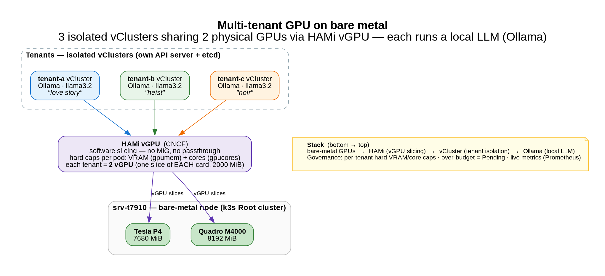

# Multi-tenant GPU on bare metal (HAMi)

*3 isolated tenants · 2 physical GPUs · 3 local LLMs — no MIG hardware, no GPU passthrough.*

[← all posts](./index.html)

## Watch the run

▶️ If the player doesn't load: [watch on asciinema](https://asciinema.org/a/eaoQKFsHhVDQ7qXc).
There's also a more technical [7-segment deep-dive](https://asciinema.org/a/n2EoxXTNhSslSXsg) (slicing · governance · metrics · over-budget Pending · multi-GPU).

## The idea

GPUs are expensive and usually pinned 1:1 to a single workload. I wanted **multi-tenant GPU sharing with
hard isolation** — on commodity cards, in a homelab. The stack, bottom to top:

- 🟩 **2 physical GPUs** (Tesla P4 + Quadro M4000) on one k3s node
- 🟪 **[HAMi](https://github.com/Project-HAMi/HAMi)** (CNCF) slices them in **software** with **hard limits** — VRAM (MiB) and compute (%) **per pod**
- 🟦 each tenant runs inside its own **vCluster** (isolated API server + etcd)
- 🤖 each tenant runs a **local LLM** (Ollama, `llama3.2`) — and gets **2 vGPU** (one slice of *each* card), so the model loads across both

Three tenants share the **same two GPUs at once**, each capped and isolated.

## The three stories

To make it fun, I asked each tenant's LLM for a different Kubernetes story:

- 💘 **tenant-a** — a love story between two Pods (*Podina &amp; Nodey, stuck in a scheduling loop*)
- 🦹 **tenant-b** — a heist on the etcd vault (*a Pod and its sidecar crack the Secret*)
- 🕵️ **tenant-c** — a noir mystery (*Detective "The Docker" Murphy hunts whoever keeps OOM-killing the cluster*)

Same hardware, three isolated tenants, three local models, three stories.

## The governance is real

- **Hard caps:** a pod can't see or exceed its VRAM slice — `nvidia-smi` inside a tenant shows only *its* MiB.
- **No overcommit:** ask for more VRAM than a card has free and the scheduler keeps you **Pending**
  (`CardInsufficientMemory`) — you can't starve your neighbours.
- **Metrics:** per-tenant usage (limit vs used) is exported by HAMi to **Prometheus / Grafana**.

## Why it matters

This is the pattern behind GPU-as-a-service for an internal platform: tenants get isolated, metered,
quota-enforced slices of shared accelerators — without dedicating a whole card (or a whole node) to each.

## The YAML that makes it work
- [`bonus/ollama-gpu.yaml`](https://github.com/villadalmine/vcluster-idp/blob/main/bonus/ollama-gpu.yaml) — Ollama on 2 HAMi vGPU slices (+ PVC).
- [`bonus/tenant-llm-2gpu.yaml`](https://github.com/villadalmine/vcluster-idp/blob/main/bonus/tenant-llm-2gpu.yaml) — the per-tenant LLM (2 vGPU, one slice per card).
- [`bonus/gpu-greedy-pending.yaml`](https://github.com/villadalmine/vcluster-idp/blob/main/bonus/gpu-greedy-pending.yaml) — the over-budget request that stays Pending (guardrail).
- [`bonus/tenant-gpu-pod.yaml`](https://github.com/villadalmine/vcluster-idp/blob/main/bonus/tenant-gpu-pod.yaml) — a tenant pod with a single capped slice.

---

Manifests, scripts and the full write-up:
<a href="https://github.com/villadalmine/vcluster-idp/tree/main/bonus">github.com/villadalmine/vcluster-idp/bonus</a>
