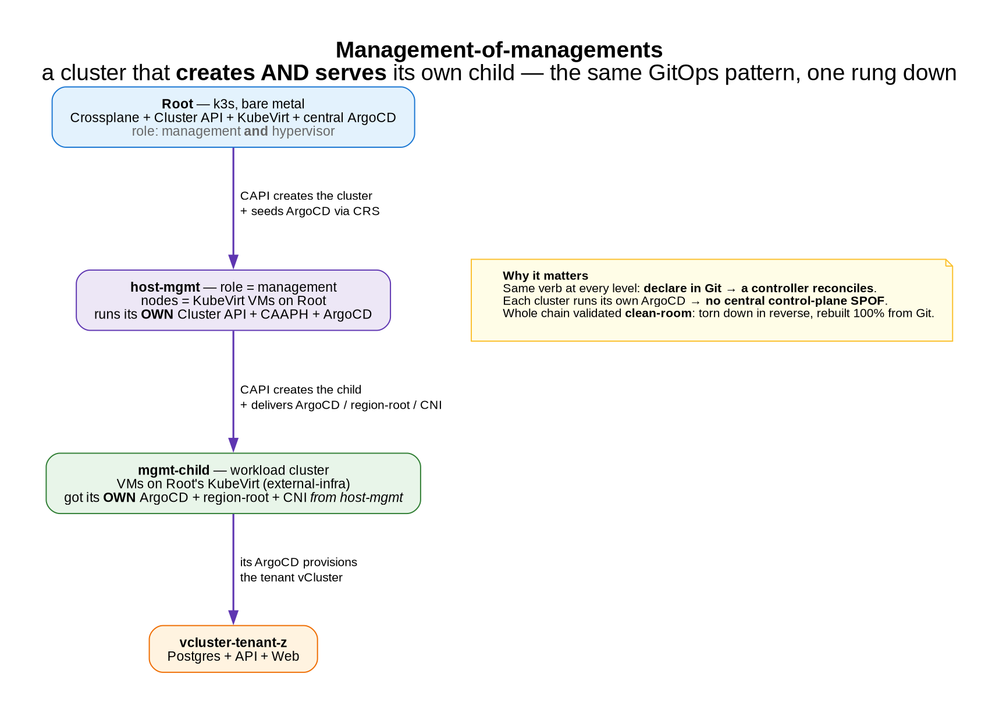

# Recursion: management-of-managements

*I built a Kubernetes cluster that builds another cluster — which then builds its own tenants. A homelab lab.*

[← all posts](./index.html)

## The idea

The same pattern repeats at every level: **declare the desired state in Git, a controller reconciles it.**
Only *what* gets reconciled changes (a VM, a cluster, a tenant) — not *how*. Take that far enough and you get
a **management-of-managements**: a cluster that creates *and fully serves* its own child.

## Walk the chain (live)

[(watch on asciinema)](https://asciinema.org/a/gYZPWvobOhFDr0Ew) — or the full [topology showcase](https://asciinema.org/a/w2oxEgyacAJSRDQI) (all 6 models; recursion is section 6).

## How it works

1. **Root** (k3s, bare metal) runs Crossplane + Cluster API + KubeVirt + a central ArgoCD. It creates host
   clusters whose **nodes are KubeVirt VMs**. One of them is `role=management`.
2. **host-mgmt** runs its **own** full Cluster API + **CAAPH** (Cluster API Add-on Provider for Helm), and
   **creates its own child** (`mgmt-child`) via CAPK *external-infra* — the child's VMs run on **Root's**
   KubeVirt, since host-mgmt has no hypervisor of its own.
3. host-mgmt then **delivers the child the same stack Root gives its regionals**: ArgoCD (a CAAPH
   `HelmChartProxy`), a `region-root` (a `ClusterResourceSet`), and the CNI — seeded from outside first,
   because a cluster can't run ArgoCD without a network (chicken-and-egg).
4. So **mgmt-child ends up decentralized**: its **own** ArgoCD provisions **its** region's tenants — e.g.
   `vcluster-tenant-z` running Postgres + API + Web.

## Why it matters

- **Fractal:** the management plane isn't one special cluster — *any* cluster can become a management that
  creates and serves its children. That's how you scale a fleet hierarchically.
- **No central SPOF:** ArgoCD is sharded per cluster; a failure's blast radius is bounded to that cluster.
- **Reproducible:** the whole chain was validated **clean-room** — torn down in reverse (tenant → child →
  management) and rebuilt **100% from Git**.

## Key tech

`Cluster API` (clusters as objects) · `CAPK` (nodes as KubeVirt VMs) · **external-infra** (a child's VMs on
another cluster's hypervisor) · `CAAPH` (installs ArgoCD *into* a cluster) · `ClusterResourceSet` (seeds CNI
+ region-root) · `Crossplane` (the `HostCluster` API) · decentralized `ArgoCD` per cluster.

## The YAML that makes it work
- [`clusters/homelab/host-mgmt.yaml`](https://github.com/villadalmine/vcluster-idp/blob/main/clusters/homelab/host-mgmt.yaml) — the `role=management` host cluster (Crossplane HostCluster).
- [`clusters/management/mgmt-child-cluster.yaml`](https://github.com/villadalmine/vcluster-idp/blob/main/clusters/management/mgmt-child-cluster.yaml) — the child cluster host-mgmt creates (CAPK external-infra).
- [`clusters/management/mgmt-child-addons.yaml`](https://github.com/villadalmine/vcluster-idp/blob/main/clusters/management/mgmt-child-addons.yaml) — the stack delivered to the child: ArgoCD + region-root + CNI.
- [`clusters/management/mgmt-child-addons-crs.yaml`](https://github.com/villadalmine/vcluster-idp/blob/main/clusters/management/mgmt-child-addons-crs.yaml) — the ClusterResourceSet that seeds it.
- [`clusters/management/helmchartproxy-capi.yaml`](https://github.com/villadalmine/vcluster-idp/blob/main/clusters/management/helmchartproxy-capi.yaml) — CAAPH installing Cluster API / ArgoCD into the management cluster.
- [`clusters/cni/clusterresourceset-calico-vxlan.yaml`](https://github.com/villadalmine/vcluster-idp/blob/main/clusters/cni/clusterresourceset-calico-vxlan.yaml) — CNI bootstrap (egg-and-chicken).
- [`fleet/config/crossplane-composition.yaml`](https://github.com/villadalmine/vcluster-idp/blob/main/fleet/config/crossplane-composition.yaml) — the HostCluster → CAPI/KubeVirt composition.

---

Source:
<a href="https://github.com/villadalmine/vcluster-idp/tree/main/clusters/management">clusters/management/</a>
(the child cluster, CAAPH proxies, and the seeded region-root).
