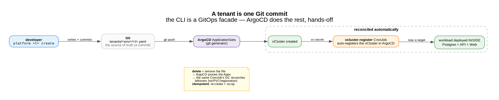

# A tenant is one Git commit

*Tenant lifecycle with zero manual steps — declare in Git, ArgoCD does the rest. A homelab lab.*

[← all posts](./index.html)

## The idea

The CLI doesn't deploy anything. `platform <tenant> create` just **writes and commits**
`tenants/<env>/<tenant>.yaml` — the source of truth — and lets **ArgoCD reconcile** it. From that one commit
you get a vCluster, its auto-registration in ArgoCD, and the workload (Postgres + API + Web) deployed
**inside** it. No `kubectl`, no `helm`, no manual register step.

The piece that makes it truly hands-off is a `vcluster-register` **CronJob** that registers each new vCluster
as an ArgoCD target on its own — so the workload lands inside it without anyone wiring it up.

## Add (one commit → fully provisioned)

## Delete (remove the file → prune + GC)

Delete is symmetric: remove the file → ArgoCD prunes the Apps → the same CronJob's **GC** reconciles the
leftovers (namespace, PVC, registration). And it's **idempotent**: re-running `create` re-asserts the same
desired state (no duplicates), `selfHeal` repairs drift, and deleting a missing tenant is a no-op.

## Why it matters

Tenant onboarding/offboarding becomes a **pull request, not a runbook** — auditable, reviewable, reversible,
self-healing. The difference between "a script someone ran" and "the cluster converges to what Git says."

## The YAML that makes it work
- [`cli/platform`](https://github.com/villadalmine/vcluster-idp/blob/main/cli/platform) — the GitOps facade (`create` / `delete` / `status`).
- [`platform/vcluster-register/vcluster-register.yaml`](https://github.com/villadalmine/vcluster-idp/blob/main/platform/vcluster-register/vcluster-register.yaml) — the CronJob that auto-registers vClusters **and** GCs leftovers on delete.
- [`applicationsets/tenants-appset.yaml`](https://github.com/villadalmine/vcluster-idp/blob/main/applicationsets/tenants-appset.yaml) — `selfHeal` + `prune` (idempotency & drift).
- [`tenants/dev/tenant-a.yaml`](https://github.com/villadalmine/vcluster-idp/blob/main/tenants/dev/tenant-a.yaml) — what a tenant's "source of truth" looks like.

---

Source: <a href="https://github.com/villadalmine/vcluster-idp">github.com/villadalmine/vcluster-idp</a>.
