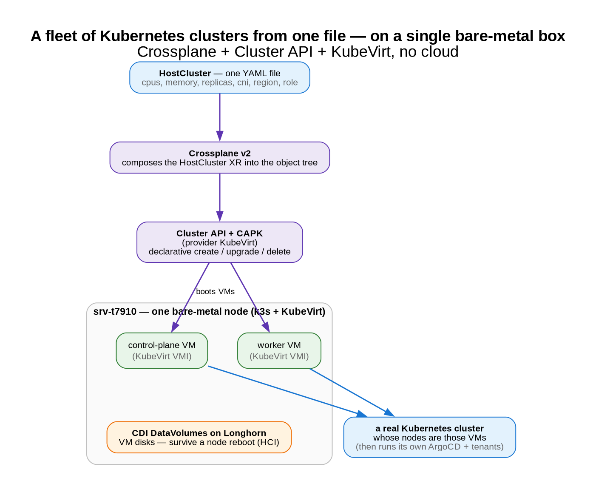

# A fleet of clusters from one file

*Whole Kubernetes clusters from a single YAML file — on one bare-metal box, no cloud. A homelab lab.*

[← all posts](./index.html)

## The idea

- A custom **`HostCluster`** resource (our own platform API) describes a cluster in a few lines: CPUs,
  memory, replicas, CNI, region, role.
- **Crossplane v2** composes that one file into the **Cluster API** object tree.
- **Cluster API + CAPK** (the KubeVirt provider) turn it into a **real cluster whose nodes are KubeVirt VMs**
  on the physical node — declarative create / upgrade / delete.
- VM disks are **CDI DataVolumes on Longhorn**, so a disk **survives a node reboot** (HCI-style).

Adding a cluster to the fleet = **one more `HostCluster` file**. Each created cluster then runs its own
ArgoCD and its own tenants (see the [recursion post](./03-recursion-management-of-managements.html)).

## See it

The platform showcase — KubeVirt VMs backing the fleet, Crossplane `HostCluster`s, CAPI clusters, ArgoCD:

Reaching the created host clusters (via jump pods) — VM→node placement, per-layer health:

## Why it matters

It's **clusters-as-data**: the fleet is a directory of small declarative files, not a pile of imperative
provisioning scripts. The same approach scales from a homelab box to real infrastructure by swapping the
Cluster API infra provider (KubeVirt here; a cloud or bare-metal provider in prod).

**Honest limitation:** it's a single physical node, so it's a real SPOF. The production answer is multiple
hypervisor nodes + control planes spread across them + replicated storage + `MachineHealthCheck`.

## The YAML that makes it work
- [`fleet/config/crossplane-xrd.yaml`](https://github.com/villadalmine/vcluster-idp/blob/main/fleet/config/crossplane-xrd.yaml) — the custom `HostCluster` API (the few-line interface).
- [`fleet/config/crossplane-composition.yaml`](https://github.com/villadalmine/vcluster-idp/blob/main/fleet/config/crossplane-composition.yaml) — composes a `HostCluster` into the CAPI/CAPK object tree.
- [`clusters/homelab/host-euw1.yaml`](https://github.com/villadalmine/vcluster-idp/blob/main/clusters/homelab/host-euw1.yaml) — an actual HostCluster (one file = one cluster).
- [`fleet/kubevirt/`](https://github.com/villadalmine/vcluster-idp/tree/main/fleet/kubevirt) + [`fleet/cdi/`](https://github.com/villadalmine/vcluster-idp/tree/main/fleet/cdi) — KubeVirt + CDI (VMs and their disks).
- [`fleet/config/storageclass-vm.yaml`](https://github.com/villadalmine/vcluster-idp/blob/main/fleet/config/storageclass-vm.yaml) — the Longhorn StorageClass for VM disks.

---

Source: <a href="https://github.com/villadalmine/vcluster-idp/tree/main/fleet">fleet/</a> ·
<a href="https://github.com/villadalmine/vcluster-idp/tree/main/clusters/homelab">clusters/homelab/</a>.
